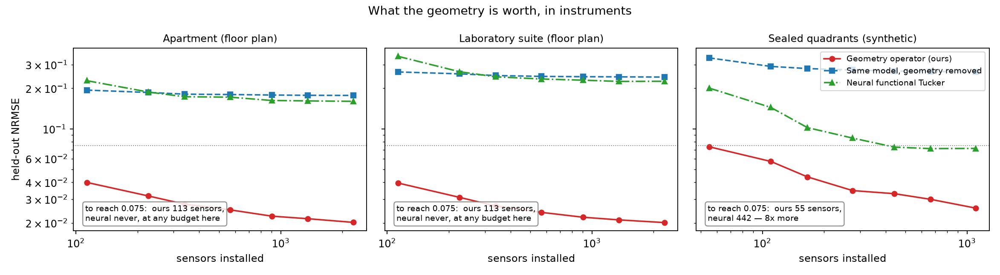

# Geometry-aware Tensor Factorization through Operator-defined Functional Subspaces

Track 1 of the [Physics-Informed Tensor Learning Hub](https://github.com/xuangu-fang/Geo-Aware-Tensor).

---

## 交接文档从这里开始

| 文档 | 内容 |
|---|---|
| **[`docs/HANDOVER_ZH.md`](docs/HANDOVER_ZH.md)** | **主文档**：公式推导、诊断量、踩过的坑、全部实验设定、related work、代码地图 |
| [`docs/DATASETS.md`](docs/DATASETS.md) | 数据来源、生成流程、从零重建（含外部数据下载链接与处理脚本） |
| [`docs/ITERATIONS.md`](docs/ITERATIONS.md) | 研究日志：按时间顺序的全部迭代，**含失败与被推翻的假设** |
| [`docs/TODO.md`](docs/TODO.md) | 待办，以及明确**不做**的事和理由 |
| [`docs/PAPER_TECHNICAL_REPORT_ZH.md`](docs/PAPER_TECHNICAL_REPORT_ZH.md) | 论文向技术报告（§14–15 是当前结论） |

新同学建议顺序：本页 → `HANDOVER_ZH.md` 第一、二部分 → 跑一遍 §5.4 的命令 →
`HANDOVER_ZH.md` 第四部分（坑）。

---

## 这个项目在做什么

一句话：

> **几何先验值不值得用，可以在拟合任何模型之前算出来。**
> 值得用时，把几何写进空间因子所在的函数空间，稀疏观测下的重构显著更好；不值得用时，
> 优势精确为零。

普通张量补全把网格节点当作无意义的类别编号——墙两侧相距 5 厘米的两点，和同一房间里
相距 5 米的两点，在它看来是一样的。我们把已知几何装配成算子，用它的前 $K$ 个特征函数
作为空间因子的字典：

$$
U_{\text{node}} = \Phi W, \qquad K\phi_k = \lambda_k M \phi_k .
$$

待学参数从 $N \times R$（如 $5520 \times 16$）降到 $K \times R$（如 $16 \times 16$），
而且每个节点的因子行都通过 $\Phi$ 与其余节点绑定。

---

## 主结果

**核心消融**：`geometry_operator` 与 `blind_operator` 是**同一个模型**——同一节点集、
decoder、优化器、先验、闭式核后验——只差算子知不知道几何。10% 传感器观测，五个全新种子：

| 布局 | ours | 去掉几何 | 倍数 | 配对胜 |
|---|---:|---:|---:|---|
| `plane_barrier/open` *(对照)* | 0.021 | 0.021 | **1.00** | 2/5 |
| `plane_domain/square` *(对照)* | 0.021 | 0.021 | **1.00** | 2/5 |
| `volume_barrier/open` *(对照)* | 0.039 | 0.039 | **1.00** | 4/5 |
| `floorplan/open_plan` *(对照)* | 0.018 | 0.018 | **1.00** | — |
| `plane_domain/U_shape` | 0.019 | 0.045 | 2.35 | 5/5 |
| `plane_barrier/chamber` | 0.048 | 0.178 | 3.70 | 5/5 |
| `floorplan/apartment` | — | — | **8.23** | 5/5 |
| `plane_barrier/sealed_4` | 0.029 | 0.267 | **9.19** | 5/5 |
| `floorplan/lab_suite` | — | — | **11.44** | 5/5 |
| `sphere/open_ocean` | 0.041 | 0.563 | **13.91** | 5/5 |

十五个带几何的布局在两个采样协议下**全部 5/5**；四个无几何的对照并列到小数点后三位、
胜率随机。二维十个布局**全部战胜坐标网络**（1.50–2.72×），且参数少一个量级
（288 vs 2 982）。

**经典方法在传感器采样下不是弱，是未定义**：未观测节点的因子行出现在零个方程里，
CP-ALS 与 Tucker-HOOI（SVD 初始化、开天眼选秩、跑满迭代）精确返回 1.000。同样两个例程
在随机缺失下是 0.27–0.66 的正常对手。

**不是只对扩散有效**：同一套几何换成阻尼波动方程，随机缺失 10% 下 1.80–2.79×。

---

## 什么时候不该用

条件不是"算子类别正确"，而是：

> **几何必须仍然约束场能去哪里。动力学能绕开的障碍，不再是几何。**

给真值加入对流（学习器不动，速度在墙内为零）：全密封布局在对流强过扩散一百倍时仍有
**6.5×**；有开口的布局同样条件下降到 **0.95×**——流体直接从开口穿过去了。

两个外部真实数据集落在条件之外，结果与条件一致：圆柱绕流（PIV 实测）1.00–1.08×，
方腔流 24 种长宽比 0.74–1.07×。开放通道里的孤立障碍不约束流场。

---

## 应用：几何值多少个传感器

`apartment`（11 310 节点）：

| 传感器 | ours | 去掉几何 | 神经 Tucker |
|---:|---:|---:|---:|
| 113 (1%) | **0.040** | 0.194 | 0.228 |
| 2 262 (20%) | 0.020 | 0.177 | 0.160 |

**基线在 20 倍预算下仍达不到我们 1% 预算的精度**，而且几乎不随传感器数改善。它们不是
数据不够，是函数空间放不下墙上的断层。



---

## 快速开始

```bash
export PYTHONPATH=src
python -m pytest -q                    # 62 项，约 55 秒
python experiments/check_install.py    # 秒级，不需要 GPU，先跑这个

# 主表的一个家族（超参全部来自 YAML）
python experiments/run_geometry_main.py --config configs/main.yaml \
  --families plane_barrier --output results/my_run

# 论文图
python experiments/plot_floorplan_basis.py --output results/my_figs --layout apartment
python experiments/plot_reconstruction.py  --output results/my_figs --layout apartment
```

`check_install.py` 只测一个**事前已知答案**的量：无障碍时几何感知与几何盲是同一个算子，
比值必须是 1.00。不是 1.00 就先别跑实验。

**超参不写死**：`configs/main.yaml` 是产生当前主表的配置，每个值旁边标注了理由在文档
哪一节；命令行 flag 覆盖它，合并结果写进产物的 `configuration` 字段。另有
`configs/wave.yaml`（波动变体）与 `configs/quick.yaml`（分钟级冒烟）。

依赖：`torch`、`numpy`、`scipy`、`tensorly`、`matplotlib`、`pyyaml`。**不需要**任何
网格库——网格是自建的（`scipy.spatial.Delaunay`）。主表数据全部由代码生成，不需要下载
任何文件。

---

## 三个必须先知道的坑

1. **不要从别的实验照搬秩。** `(4,4,6)` 来自 $18\times24\times24$ 的一维实验，搬到
   5 000+ 节点的网格上会让整张表**秩受限**——`sealed_4` 的 2.98× 实际是 9.73×。
   诊断办法：每行输出的 `attained_over_floor`，健康值 1.0–1.5。
2. **分辨率由最小几何特征定，不是由节点数定。** 障碍比一个单元还薄时结果不可信，
   **而且偏差方向不可预测**（我们两次都踩了，一次夸大一次低估）。
3. **cutoff 有两条规则，必须同时满足**：近似能力跨设定可比，且 `cutoff × rank`
   不超过传感器数。只满足第一条会让"更好的基估不出来，输给估得准的差基"。

细节见 [`docs/HANDOVER_ZH.md`](docs/HANDOVER_ZH.md) 第四部分。

---

## 代码地图

| 文件 | 职责 |
|---|---|
| `src/geoaware/benchmark.py` | **所有主实验的数据入口**，四个几何家族一条路径 |
| `src/geoaware/floorplan.py` | 楼层平面家族（米制真实尺寸） |
| `src/geoaware/grouped_operator_tucker.py` | **模型**：Tucker/CP、三种因子、闭式核后验 |
| `src/geoaware/operator_diagnostics.py` | **诊断量**：投影残差、稀疏特征对、可观测性 |
| `src/geoaware/simplex_fem.py` | 任意维单纯形 P1 有限元，稠密与稀疏 |
| `src/geoaware/als_baselines.py` | TensorLy 的 CP-ALS / Tucker-HOOI |
| `experiments/run_geometry_main.py` | 主实验 runner |
| `experiments/plot_*.py` | 论文图 |

早期轮次的模块与当前未引用的模块见 `HANDOVER_ZH.md` 第六部分——**删除前先确认没有
`results/` 产物需要它们**。
