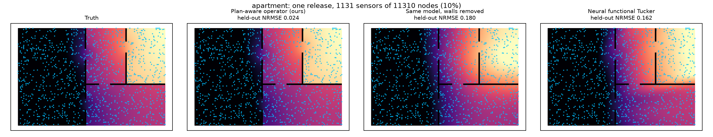
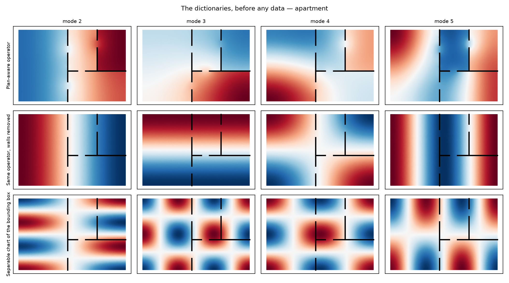

# 在复杂几何上重构物理场

Track 1 of the [Physics-Informed Tensor Learning Hub](https://github.com/xuangu-fang/Geo-Aware-Tensor).

---

## 一句话

**真实的物理场几乎从不长在干净的矩形上**——楼里有墙，海里有岛，厂房里有隔断。
普通的张量分解不知道这件事，会把浓度平滑地抹过墙。我们把已知的几何告诉模型，
让它只能拼出"不穿墙"的结果。

几何越复杂，好处越大：从 1.0 倍（没有墙时，**必须**没有好处）到 13.9 倍。

---

## 问题长什么样

你要重构一栋楼里的污染物浓度，手上只有几十个传感器，要推断几万个位置。

**普通张量分解把"位置"当成一个编号。** 1 号点、2 号点、3 号点，编号之间没有任何关系。
于是它会推断"5 号点和 6 号点的值接近，所以它们相关"——但如果这两点**分别在一堵墙的两侧**，
它们在物理上几乎不交换任何东西，只是碰巧在欧氏距离上靠得近。

这个错误在图上一眼可见：



真值（左一）在墙处是一道**陡峭的断层**。我们的方法（左二）还原了它；不知道墙的同一个
模型（左三）和坐标神经网络（右一）都把浓度**抹过了墙**，在另一侧凭空造出了不存在的污染。

**更极端的是传感器稀疏的情况**：没装传感器的位置，在普通张量分解里**一个方程都没有**。
不是数据少，是零个约束。标准的 CP-ALS 和 Tucker 分解在那些位置精确输出零（NRMSE = 1.000），
无论用什么秩、跑多少轮。

---

## 我们做什么

**几何信息其实是免费的**——楼层平面图任何一栋楼都有，海岸线是公开地图。真正难测的是
材料参数（空气的有效扩散率之类），那些我们**不假设知道**。

做法打个比方：普通方法给模型一支笔，让它在整张平面图上随便画；我们先根据平面图裁出
一批"积木"，**每块积木都自动在墙处断开、在门洞处连通**，然后让模型只能用这些积木拼。



上面这张图是**拟合之前**的——不含任何数据。第一行是我们的积木（在墙处断开），第二行是
"忘了墙"的同一套算子（无视墙的平滑斜坡），第三行是把楼当成矩形的可分基（完全盲目的
棋盘格）。

好处有两个：拼出来的结果**天然不穿墙**；要学的东西**少一个数量级**（288 个参数
vs 神经网络的 2 982 个）。

---

## 结果

**19 种几何**：平面隔板、挖孔的域、L 形和 U 形房间、三维隔墙、球面、四种真实尺寸的
楼层平面图。对比方式：**同一个模型、同一套传感器、同样的训练**，唯一区别是算几何形状时
知不知道墙在哪。

| 几何 | 知道几何 | 不知道几何 | 好多少倍 | 配对胜 |
|---|---:|---:|---:|---|
| 空房间（**对照**） | 0.021 | 0.021 | **1.00** | 2/5 |
| 三维空盒（**对照**） | 0.039 | 0.039 | **1.00** | 4/5 |
| 挖一个孔 | 0.020 | 0.035 | 1.7 | 5/5 |
| U 形房间 | 0.019 | 0.045 | 2.4 | 5/5 |
| 走廊 + 三个房间 | — | — | 4.5 | 5/5 |
| 两室一厅 | — | — | **8.2** | 5/5 |
| 四个密封象限 | 0.029 | 0.267 | **9.2** | 5/5 |
| 实验室套间（内间经气闸） | — | — | **11.4** | 5/5 |
| 球面 | 0.041 | 0.563 | **13.9** | 5/5 |

**头两行是整个论证的支点**：没有墙的时候，"知道几何"和"不知道几何"本来就是同一件事，
所以两个数字必须一模一样——它们确实精确到小数点后三位相同，胜率也是随机的。
**这排除了"你们的模型本来就更好"这种解释，差距只能来自几何。**

十五个有几何的布局，两种采样方式，**全部 5/5 胜**。二维的十个布局**全部赢过坐标神经
网络**（1.5–2.7 倍），而且参数少一个数量级。

**不是只对扩散有效**：同一套几何换成波动方程，仍有 1.8–2.8 倍。

---

## 换成传感器数量来说

同一栋楼，横轴是装了多少个传感器：


**红线一直在降，蓝绿两条早早躺平。** 基线从 113 个传感器加到 2 262 个（20 倍），误差
只从 0.194 降到 0.177——**它们不是数据不够，是函数空间里放不下墙上的断层，加多少传感器
都补不上。** 我们用 113 个传感器就比它们用 2 262 个还准 4 倍。

---

## 什么时候不该用

条件不是"物理方程要对"，而是：

> **几何必须真的限制住场能去哪里。流体能绕开的障碍，等于没有障碍。**

受控实验：给场加上越来越强的流动。全密封的隔间在流速极强时仍有 **6.5 倍**优势（再快也
过不去封死的墙）；**有门洞的**隔间在同样流速下降到 **0.95 倍**——流体直接从门洞穿过去了。

这解释了我们在两个真实数据集上**没有**优势：圆柱绕流（水槽里一根柱子，1.00–1.08 倍）
和方腔流（开放的方盒子，0.74–1.07 倍）。它们的障碍都不真正限制流体。**这不是方法失败，
是问题不在适用范围内——而且这件事在跑任何模型之前就能算出来。**

---

## 交接文档

| 文档 | 内容 |
|---|---|
| **[`docs/tex/report.pdf`](docs/tex/report.pdf)** | **技术文稿（PDF，15 页）**。论文体例：动机与背景、任务设定、方法与推导、算法表、实验设定与结果、已知边界。公式与图表都正常渲染，适合打印和离线阅读 |
| **[`docs/HANDOVER_ZH.md`](docs/HANDOVER_ZH.md)** | **主文档**。第零部分不用公式讲清全部要点；之后是推导、算法表、从零跑动指南、踩过的坑、全部实验设定、related work |
| [`docs/DATASETS.md`](docs/DATASETS.md) | 数据来源、生成流程、从零重建（含外部数据下载链接） |
| [`docs/ITERATIONS.md`](docs/ITERATIONS.md) | 研究日志：全部迭代，**含失败与被推翻的假设** |
| [`docs/TODO.md`](docs/TODO.md) | 待办，以及明确**不做**的事和理由 |

新同学建议顺序：本页 → `HANDOVER_ZH.md` **第零部分**（不用公式）→ 跑一遍下面的快速开始
→ `HANDOVER_ZH.md` 第四部分（踩过的坑）。

## 快速开始

```bash
export PYTHONPATH=src
python -m pytest -q                    # 62 项，约 55 秒
python experiments/check_install.py    # 秒级，不需要 GPU，先跑这个

# 主表的一个家族（超参全部来自 YAML）
python experiments/run_geometry_main.py --config configs/main.yaml \
  --families plane_barrier --output results/my_run

# 论文图
python experiments/plot_floorplan_basis.py --output results/my_figs --layout apartment
python experiments/plot_reconstruction.py  --output results/my_figs --layout apartment
```

`check_install.py` 只测一个**事前已知答案**的量：无障碍时几何感知与几何盲是同一个算子，
比值必须是 1.00。不是 1.00 就先别跑实验。

**超参不写死**：`configs/main.yaml` 是产生当前主表的配置，每个值旁边标注了理由在文档
哪一节；命令行 flag 覆盖它，合并结果写进产物的 `configuration` 字段。另有
`configs/wave.yaml`（波动变体）与 `configs/quick.yaml`（分钟级冒烟）。

依赖：`torch`、`numpy`、`scipy`、`tensorly`、`matplotlib`、`pyyaml`。**不需要**任何
网格库——网格是自建的（`scipy.spatial.Delaunay`）。主表数据全部由代码生成，不需要下载
任何文件。

---

## 三个必须先知道的坑

1. **不要从别的实验照搬秩。** `(4,4,6)` 来自 $18\times24\times24$ 的一维实验，搬到
   5 000+ 节点的网格上会让整张表**秩受限**——`sealed_4` 的 2.98× 实际是 9.73×。
   诊断办法：每行输出的 `attained_over_floor`，健康值 1.0–1.5。
2. **分辨率由最小几何特征定，不是由节点数定。** 障碍比一个单元还薄时结果不可信，
   **而且偏差方向不可预测**（我们两次都踩了，一次夸大一次低估）。
3. **cutoff 有两条规则，必须同时满足**：近似能力跨设定可比，且 `cutoff × rank`
   不超过传感器数。只满足第一条会让"更好的基估不出来，输给估得准的差基"。

细节见 [`docs/HANDOVER_ZH.md`](docs/HANDOVER_ZH.md) 第四部分。

---

## 代码地图

| 文件 | 职责 |
|---|---|
| `src/geoaware/benchmark.py` | **所有主实验的数据入口**，四个几何家族一条路径 |
| `src/geoaware/floorplan.py` | 楼层平面家族（米制真实尺寸） |
| `src/geoaware/grouped_operator_tucker.py` | **模型**：Tucker/CP、三种因子、闭式核后验 |
| `src/geoaware/operator_diagnostics.py` | **诊断量**：投影残差、稀疏特征对、可观测性 |
| `src/geoaware/simplex_fem.py` | 任意维单纯形 P1 有限元，稠密与稀疏 |
| `src/geoaware/als_baselines.py` | TensorLy 的 CP-ALS / Tucker-HOOI |
| `experiments/run_geometry_main.py` | 主实验 runner |
| `experiments/plot_*.py` | 论文图 |

早期轮次的模块与当前未引用的模块见 `HANDOVER_ZH.md` 第六部分——**删除前先确认没有
`results/` 产物需要它们**。
