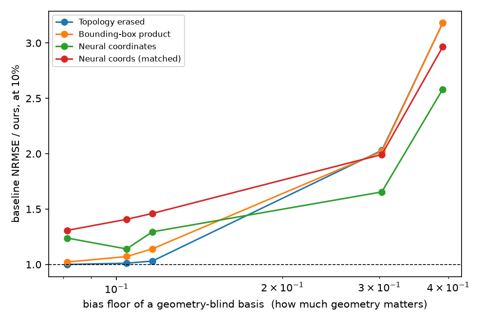

# Operator-Prior Tensor

Operator-informed Bayesian CP/Tucker for recovering continuous physical tensors from at most 10% observations.

This repository is Track 1 of the [Physics-Informed Tensor Learning Hub](https://github.com/xuangu-fang/Geo-Aware-Tensor). It is intentionally scoped to one question:

> When does an operator-defined factor space improve sample efficiency, and when does operator mismatch create irreducible bias?

The next method extension is **Group-wise Operator-Prior Tucker**: a physical
operator is attached to the coordinate group on which it is actually defined.
A joint spatial operator may constrain a grouped `(x,y)` factor; modes without
a reliable operator retain neural functional factors. Per-axis operators are an
efficient exact/approximate special case whose separability error must be
measured, not the default physical assumption.

## Current direction: geometry-aware factorization

**Geometry-aware group-wise tensor factorization through operator-defined
functional subspaces.**  When a physical tensor lives on a domain with a
non-trivial boundary — obstacles, baffles, sealed chambers — ordinary tensor
completion has no way to know that two Euclidean-nearby points may be far apart
for the physics.  We extract that boundary information as the spectrum of a
discrete operator and use it to define the factor space.

The benchmark keeps one fixed mesh on the unit square and varies only the
barriers inside it, so every control differs from the proposed model in exactly
one respect — whether its operator knows the geometry — with no interpolation
between node sets.  The learner is told where the barriers are and never sees
the smooth background material, so this is a geometry prior, not exact physics.

At 10% of mesh nodes observed for their whole trajectory (three seeds,
selection seeds 41--43):

| model | open | labyrinth | arc | chamber | sealed_4 |
|---|---:|---:|---:|---:|---:|
| geometry operator (ours) | 0.217 | 0.218 | 0.223 | **0.197** | **0.158** |
| topology erased | 0.217 | 0.221 | 0.230 | 0.401 | 0.502 |
| bounding-box product | 0.222 | 0.234 | 0.255 | 0.399 | 0.502 |
| neural coordinates (wide) | 0.269 | 0.249 | 0.289 | 0.326 | 0.408 |
| discrete Tucker | 1.476 | 1.472 | 1.495 | 1.506 | 1.617 |
| permuted control | 1.204 | 1.202 | 1.221 | 1.310 | 1.220 |

Three things hold together.  On the barrier-free control the geometry-aware and
topology-erased models return *identical* numbers, so the margin is not a
capacity artifact.  The margin then grows monotonically with how much geometry
there is to know, reaching 3.2x against blind spectral bases and 2.6x against a
six-times larger coordinate network.  And ordinary discrete completion fails
everywhere the method works.

The advantage switches on at a measurable place: it is exactly 1.00 while the
bias floor of ignoring the geometry stays below the attainable error, and rises
steeply once it exceeds it.

Refitting only the small Tucker core after swapping in a new layout's basis
beats training the same model on the new layout's 2% alone in 15 of 15
pair-seed cells, so the factor space itself transfers between geometries.

Earlier rounds are kept rather than discarded: two falsified design hypotheses
and one failed attempt to learn the spectral cutoff are recorded in
`docs/ITERATIONS.md`.

## Frozen one-dimensional anchor

- Observation ratios: 2%, 5%, and 10%; the confirmation uses five fresh seeds
  and exactly 400 updates after freezing cutoff 8 and rank `(4,5,5)` on the
  earlier three selection seeds.
- The synthetic principal-angle phase boundary is now complemented by a
  variable-coefficient diffusion Green-response benchmark.  Its mismatch
  changes physical eigenfunctions and decay rates; every result stores the
  measured oracle projection residual.
- On the physical benchmark, 10% random and receiver-fiber masks both reach
  the predeclared 4/5 paired-win gate against a wide Neural Functional Tucker.
  Random NRMSE is `0.165±0.010` vs `0.207±0.054`; receiver-fiber is
  `0.217±0.052` vs `0.269±0.112`.
- The claim has a sharp boundary: source-fiber reaches only 3/5 wins at 10%,
  and 2% structured masks favor the neural baseline.  This is a conditional GO,
  not a claim of universal superiority under extreme sparsity.
- Basis cutoff has a real bias--variance tradeoff: reducing projection residual
  from 0.165 to 0.025 does not monotonically improve 2% reconstruction.
- Matched Tucker rank sweeps show that the 10% signal is not explained by one
  hand-picked core size, while 2% remains optimization/data limited.

The main claim is a measurable bias--variance phase boundary, not universal superiority over neural functional tensor models.



## Repository map

- `src/geoaware/`: active modules are `grouped_operator_tucker.py` (order-M Tucker
  over coordinate groups), `irregular_fem.py` (self-contained P1 meshing on
  polygonal domains), `irregular_green_data.py` (barrier layouts and the two
  tensor settings), `operator_diagnostics.py` (bias floors and subspace
  residuals), and `masks.py`.  The frozen one-dimensional path —
  `tensor_bayes.py`, `tensor_data.py`, `operator_tucker_baselines.py`,
  `bases.py` — is unchanged.
- `experiments/`: fixed-budget phase-diagram runners and analysis.
- `results/`: immutable raw artifacts migrated from the hub.
- `docs/TECHNICAL_REPORT.md`: formulation, inference, baselines, dataset cards, and current evidence.
- `docs/PAPER_TECHNICAL_REPORT_ZH.md`: paper-facing Chinese Introduction/Method,
  frozen confirmation design, complete fresh-seed table, claim boundaries, exact
  operator provenance, the group-wise formulation, joint-vs-axis phase experiment,
  irregular-domain POC plan, and a new-session handoff.
- `docs/DATASETS_AND_RESOURCES.md`: local/shared datasets, official resources,
  operator-metadata requirements, leakage rules, and dataset implementation order.
- `docs/ITERATIONS.md`: repository-local research diary.
- `docs/SHARED_PROTOCOL.md`: shared audit discipline inherited from the hub.

## Quick check

```bash
PYTHONPATH=src python -m pytest -q
```

Large datasets and caches are not committed. Generated results must record seeds, masks, observation ratios, optimization budgets, and the exact generator or dataset version.
