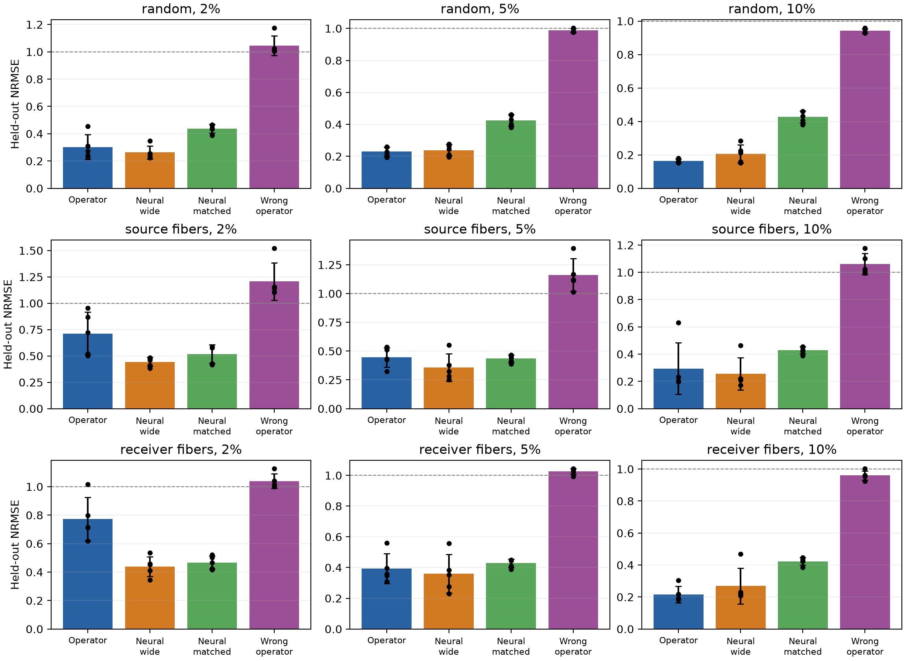
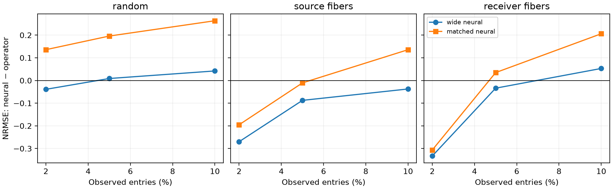

# 方向 1 论文级技术报告：用物理算子约束连续 Tucker 因子

更新时间：2026-08-16

实验冻结版本：`diffusion_confirmation_r4`
当前判断：**随机缺失与 receiver-fiber 的 10% 确认 gate 通过；source-fiber 只有 3/5，因而是有边界的 GO，不是“极稀疏条件下普遍优于神经张量”。**

## 摘要

本文研究一个很具体的问题：当物理张量的每个 mode 对应时间、接收位置或激励位置，并且这些坐标上已有可信的微分算子时，能否直接利用该算子的低频特征函数，减少连续 Tucker 分解在稀疏观测下需要学习的自由度？

我们把普通 Tucker 因子表替换成

\[
U_m=\Phi_m W_m,
\]

其中 $\Phi_m$ 是第 $m$ 个物理算子的有限谱基，$W_m$ 是待学习的小矩阵。模型仍保留一个非对角 Tucker core，从而表达时间、接收端和源端之间的耦合。训练阶段对 $W_m$ 和 core 做带算子谱能量的正则化点估计；因子固定后，对小 core 做解析高斯后验推断。

在变系数扩散 Green-response tensor 上，我们先用旧 seeds 选择 cutoff 8 和 Tucker rank $(4,5,5)$，随后完全冻结模型、400 次更新、噪声和所有超参数。五个全新 seeds 的结果表明：10% random mask 下，Operator Tucker 以 `0.164±0.011` 的 NRMSE 优于宽 Neural Functional Tucker 的 `0.207±0.054`，paired wins 为 4/5；10% receiver-fiber 下仍为 4/5 wins。置乱算子基的 negative control 接近 NRMSE 1，说明收益来自正确的 index–operator 对齐。不过 source-fiber 只有 3/5 wins，2%--5% 也不稳定。

因此本文最合适的主张不是“低秩张量用于 PDE”，而是：

> 一个近似正确的 operator-defined factor space 能显著减少 Tucker 因子的估计方差；有限谱截断同时引入可测的 projection bias，两者共同形成随观测率、截断阶数和算子失配变化的 bias–variance phase diagram。

## 1. 为什么要做这件事

### 1.1 普通 Tucker 忽略了 mode index 的物理含义

给定三阶张量 $Y\in\mathbb R^{N_1\times N_2\times N_3}$ 和稀疏观测集合 $\Omega$，普通 Tucker completion 写成

\[
Y_{i_1i_2i_3}\approx
\sum_{r_1=1}^{R_1}\sum_{r_2=1}^{R_2}\sum_{r_3=1}^{R_3}
G_{r_1r_2r_3}
U_1(i_1,r_1)U_2(i_2,r_2)U_3(i_3,r_3).
\]

如果直接学习 $U_m\in\mathbb R^{N_m\times R_m}$，模型把每个 index 当作无关类别。它不知道：

- 相邻网格点应由扩散算子连接；
- Dirichlet、Neumann 或周期边界对应不同的函数空间；
- 网格改变、不规则边界或孔洞会改变 Laplacian 的特征函数；
- 时间 mode 的合理衰减率可由演化算子的谱给出。

神经 functional Tucker 用一维 MLP 替代 factor table，能让因子连续，但它仍需从稀疏样本中学习“什么函数是合理的”。当算子已知时，这部分自由度没有必要从头估计。

### 1.2 核心假设和适用边界

我们的核心假设只有一个：真实 tensor 在每个 mode 上的大部分能量位于已知算子的有限低频子空间附近。这个假设可被直接测量，而不是用“physics-informed”一词替代验证。

令 $P_m$ 是 learner basis 的正交投影，定义 product-space projection residual

\[
\epsilon_{\mathrm{proj}}
=\frac{\|Y-Y\times_1P_1\times_2P_2\times_3P_3\|_F}{\|Y\|_F}.
\]

$\epsilon_{\mathrm{proj}}$ 是任何被限制在这些 basis 中的方法都无法消除的近似偏差下界。较大的 basis 可减小它，却会增加待估计系数和 core interaction 的方差。因此本文要研究的是偏差和方差的平衡，而不是宣称 operator basis 永远正确。

## 2. 方法

### 2.1 每个 mode 的算子谱

对 mode $m$ 给定自伴正半定算子 $\mathcal A_m$：

\[
\mathcal A_m\phi_{mk}=\lambda_{mk}\phi_{mk},\qquad
0\leq\lambda_{m1}\leq\lambda_{m2}\leq\cdots.
\]

在离散坐标 $x_{mi}$ 上评价前 $K_m$ 个特征函数，得到

\[
\Phi_m(i,k)=\phi_{mk}(x_{mi}),\qquad
\Phi_m\in\mathbb R^{N_m\times K_m}.
\]

空间 mode 可以使用有限差分、有限元或 graph Laplacian 的 eigenvectors；演化 mode 可以使用由算子 eigenvalues 诱导的指数衰减函数。方法本身不要求规则矩形，只要求能离线得到离散算子的前若干特征对。

### 2.2 Operator-prior Tucker

我们不直接学习大因子表，而是令

\[
\widetilde U_m=\Phi_mW_m,
\qquad W_m\in\mathbb R^{K_m\times R_m}.
\]

为消除 Tucker 的连续缩放歧义，对每个 factor column 做单位 RMS 归一化：

\[
s_{mr}=\sqrt{N_m^{-1}\|\Phi_mW_m(:,r)\|_2^2},\qquad
U_m(:,r)=\frac{\Phi_mW_m(:,r)}{s_{mr}}.
\]

预测保持标准 Tucker 形式：

\[
\widehat Y_{ijk}=\sum_{abc}G_{abc}U_1(i,a)U_2(j,b)U_3(k,c).
\]

Tucker core 是必要组件，而不是装饰：Green response 的 source/receiver modes 通常共享谱结构，但其跨 mode interaction 并不一定是 CP 的超对角形式。

### 2.3 算子谱正则化

令归一化因子对应的谱系数为 $\bar W_m(:,r)=W_m(:,r)/s_{mr}$。使用 Sobolev 型能量

\[
E_m(\bar W_m)=\frac{1}{K_mR_m}
\sum_{k,r}(1+\lambda_{mk})^p\bar W_{mkr}^2.
\]

较高算子频率受到更强惩罚。实际优化目标是

\[
\mathcal L=
\frac1{|\Omega|}\sum_{(i,j,k)\in\Omega}
(y_{ijk}-\widehat Y_{ijk})^2
+\rho\left[
\frac{\|G\|_F^2}{R_1R_2R_3}+\sum_m E_m(\bar W_m)
\right].
\]

这一步应准确称为 regularized point estimation 或 Gaussian MAP，而不是完整 Bayesian inference。当前实现用 AdamW、固定 400 steps、随机 cold start；确认集不参与 early stopping 或超参数选择。

### 2.4 固定因子后的 core 后验

训练因子后，对一个 entry $q=(i,j,k)$ 定义 Tucker row feature

\[
z_q=U_1(i,:)\otimes U_2(j,:)\otimes U_3(k,:).
\]

将 core 向量化为 $g=\mathrm{vec}(G)$，建立

\[
g\sim\mathcal N(0,\alpha^{-1}I),\qquad
y_\Omega\mid g\sim\mathcal N(Z_\Omega g,\beta^{-1}I).
\]

于是

\[
\Sigma_g=(\beta Z_\Omega^\top Z_\Omega+\alpha I)^{-1},\qquad
\mu_g=\beta\Sigma_gZ_\Omega^\top y_\Omega.
\]

$\alpha$ 和 $\beta$ 通过 evidence fixed-point updates 得到。预测均值和方差为

\[
\mathbb E[y_*]=z_*^\top\mu_g,
\qquad
\operatorname{Var}(y_*)=z_*^\top\Sigma_gz_*+\beta^{-1}.
\]

这是 conditional empirical Bayes：core posterior 在固定因子条件下是解析的，但 factor、rank、cutoff 和 operator 的不确定性没有被积分。因此当前论文以 NRMSE/MAE 为主，不能把不完整的 UQ 当作主要贡献。

### 2.5 参数量

确认配置为 $K=(8,8,8)$、$R=(4,5,5)$，因此 Operator Tucker 的可训练参数数为

\[
8\times4+8\times5+8\times5+4\times5\times5=212.
\]

我们同时使用两个 Neural Functional Tucker：

- **宽模型**：每个 mode 两层宽度 48 的 MLP，共 8130 参数，作为强容量对照；
- **同参数模型**：隐藏宽度 3，共 210 参数，rank 和 core 与 proposed 完全相同，用来隔离 operator basis 的参数效率。

报告两者很重要：与宽模型比较回答“operator prior 是否仍能战胜强 neural regression”；与同参数模型比较回答“收益是否只是 proposed 参数更少”。

## 3. 物理 POC 数据

### 3.1 变系数扩散 Green response

在一维 Neumann 区间上构造

\[
\partial_tu+[L_a+\kappa I]u=0,
\qquad
L_a=-\partial_x(a(x)\partial_x),
\]

其中

\[
a(x)=\exp\{c[\cos(2\pi x)+0.35\sin(3\pi x+0.37)]\}.
\]

真值使用 $L_a$ 的前 14 个 eigenmodes，张量为

\[
Y(t,x_r,x_s)=\sum_{q=1}^{14}
e^{-t(\kappa+\mu_q)}
\psi_q(x_r)\psi_q(x_s)(1+\mu_q)^{-0.18}.
\]

shape 为 `18×24×24`，三个 modes 分别是 time、receiver 和 source。contrast 固定为 $c=1$。learner 不读取真实变系数 eigenvectors，而只使用常系数 reference operator 的前 8 个 modes，因此不是把真值生成 basis 原样交给模型。该配置实测

\[
\epsilon_{\mathrm{proj}}=0.0699.
\]

观测加入相对于 observed-value 标准差 10% 的 Gaussian noise；标准化统计量仅由 observations 计算。

### 3.2 三种缺失协议

1. `random`：从所有 entries 中均匀抽取 2%/5%/10%。
2. `source_fibers`：随机选择若干固定 $(t,x_r)$ 对，并观测对应的整条 source vector $Y(t,x_r,:)$。
3. `receiver_fibers`：随机选择若干固定 $(t,x_s)$ 对，并观测对应的整条 receiver vector $Y(t,:,x_s)$。

后两种 mask 的缺失高度相关，不能被解释为随机 entry completion。每种协议都使用五个全新 seeds `101–105`；旧 seeds `41–43` 只用于冻结 cutoff 8 和 rank $(4,5,5)$。

## 4. Baselines 和它们各自排除的解释

| 方法 | 与 proposed 的共同部分 | 被移除或替换的部分 | 回答的问题 |
|---|---|---|---|
| Neural Functional Tucker（宽） | 相同 Tucker ranks/core、连续 mode factors | 用宽 MLP 替换 operator basis | 强 neural functional tensor 能否从数据学到更好因素 |
| Neural Functional Tucker（同参数） | 相同 ranks/core，约相同参数数 | 210 参数 MLP factors | operator basis 的参数效率 |
| Wrong-operator Tucker | 相同参数数、优化和谱 eigenvalues | 独立置乱 basis 的 index 对齐 | 正信号是否真的依赖正确物理排列 |
| Operator CP | 相同 operator factors | 对角 core | 非对角 Tucker interaction 是否必要 |
| Discrete Tucker | 相同 decoder | 自由 factor tables | 谱截断相对普通低秩的作用 |
| Flat operator GP | 相同 operator features | 不做 multilinear compression | Tucker bottleneck 是否必要 |

确认 gate 的主比较只用前三项，避免在 fresh seeds 上再次选择模型。其余 baseline 用于机制消融和旧 selection 阶段。

## 5. 冻结确认实验

### 5.1 预注册式冻结

- cutoff：8；truth modes：14；
- Tucker rank：$(4,5,5)$；
- contrast：1；noise：10%；
- optimizer：AdamW；steps：400；random initialization；
- ratios：2%、5%、10%，从不超过 10%；
- confirmation seeds：101、102、103、104、105；
- promotion gate：至少一个不超过 10% 的 ratio 上 Operator Tucker 对宽 Neural Tucker 达到 4/5 paired wins、NRMSE 明显低于 1，并在至少一种 structured-fiber mask 下复现。

### 5.2 结果解释原则

主指标是所有未观测 entries 上的 NRMSE。我们同时报告：

- 五 seed mean/std，而不是只展示最好 seed；
- paired seed wins，避免均值被单个异常 seed 支配；
- wrong-operator control 的绝对 NRMSE；
- 固定 projection residual 和参数量；
- source 和 receiver fibers 分开，不在看到结果后合并成更有利的“structured”均值。

数值表和图由 `experiments/analyze_confirmation_gate.py` 从原始 JSON 直接生成，最终结果见 `results/diffusion_confirmation_summary_r4/summary.json`。

### 5.3 五个 fresh seeds 的完整结果

表中均为 held-out NRMSE 的 mean±sample std；`wins` 是 Operator Tucker 相对宽 Neural Functional Tucker 的 paired seed 胜场。

| Mask | Obs. | Operator Tucker（212） | Neural F-Tucker wide（8130） | Neural F-Tucker matched（210） | Wrong operator（212） | wins / 5 |
|---|---:|---:|---:|---:|---:|---:|
| random | 2% | 0.302±0.091 | **0.263±0.049** | 0.438±0.031 | 1.045±0.073 | 1 |
| random | 5% | **0.230±0.028** | 0.239±0.035 | 0.426±0.035 | 0.987±0.013 | 2 |
| random | 10% | **0.165±0.010** | 0.207±0.054 | 0.428±0.035 | 0.942±0.014 | **4** |
| source fibers | 2% | 0.713±0.202 | **0.443±0.043** | 0.518±0.088 | 1.207±0.178 | 0 |
| source fibers | 5% | 0.445±0.083 | **0.358±0.120** | 0.435±0.032 | 1.162±0.141 | 2 |
| source fibers | 10% | 0.294±0.189 | **0.256±0.118** | 0.429±0.027 | 1.061±0.077 | 3 |
| receiver fibers | 2% | 0.773±0.151 | **0.440±0.069** | 0.466±0.046 | 1.040±0.051 | 0 |
| receiver fibers | 5% | 0.394±0.098 | **0.360±0.126** | 0.428±0.027 | 1.025±0.020 | 2 |
| receiver fibers | 10% | **0.217±0.052** | 0.269±0.112 | 0.422±0.024 | 0.960±0.029 | **4** |

这张表给出三个清楚结论。

第一，冻结 gate 按预先规则通过：random 10% 和 receiver-fiber 10% 都达到 4/5 wins，且绝对 NRMSE 分别为 0.165 和 0.217。第二，收益不是“参数更多”：proposed 只有宽 neural baseline 的约 2.6% 参数，并显著优于 210 参数的同参数 neural baseline。第三，收益也不是 Tucker decoder 本身造成的：置乱 operator 的同架构模型基本不能完成有效重建。

但 2% 的两个 structured masks 均明显失败；source-fiber 即使在 10% 也有 seed 104 的 0.631 异常失败，导致均值优势和 4/5 gate 均不成立。最准确的状态应是 **10% random/receiver-fiber conditional GO，extreme sparsity 与 source-fiber NO-GO**。

## 6. 投稿主张、不能主张的内容与定位

### 6.1 可以主张

1. **可审计的 operator prior。** 物理信息不只是加入 loss，而是明确决定可学习 factor space；置乱 basis 会破坏性能。
2. **可测的 bias–variance mechanism。** projection residual 测量有限谱近似偏差；cutoff sweep 已表明 residual 更低不保证稀疏恢复更好。
3. **参数效率。** 212 参数 operator model 与 210 参数 neural Tucker 的直接对照隔离了表示先验。
4. **有限但真实的确认信号。** random 和 receiver-fiber 的 10% 结果通过冻结的 4/5 gate。

### 6.2 不能主张

- 不能声称 2% 下普遍优于 neural functional tensor；
- 不能声称所有 structured masks 都更强，source-fiber 只有 3/5；
- 不能声称这是 full Bayesian Tucker；
- 不能声称只凭当前一维 diffusion POC 已证明对任意 PDE、任意不规则域有效；
- 不能把较小 projection residual 等同于较小 reconstruction error。

### 6.3 与近邻工作的清楚区别

- [INN-TD（ICML 2025）](https://proceedings.mlr.press/v267/guo25p.html)把有限元局部插值函数嵌入 neural tensor architecture，重点是大规模 parametric PDE 的精度、稀疏计算和可解释性。我们的重点不是新的有限元网络，而是**已知 mode operator 的截断谱先验、稀疏 tensor completion 和可测 projection-bias/estimation-variance 相图**。
- [Sample Efficient Learning of Factored Embeddings of Tensor Fields（AISTATS 2024）](https://proceedings.mlr.press/v238/heo24a.html)通过 progressive sketching 和 Thompson sampling 选择 tensor slices，重点是数据采集策略和 compact sketches。我们的 observation mask 是外生固定的，贡献在 reconstruction prior，而不是 active sampling。
- [Functional Tensor Decompositions for PINNs（ICPR 2024）](https://arxiv.org/abs/2408.13101)用 neural CP/TT/Tucker 分离变量以缓解高维 PDE 求解。它证明 functional tensor architecture 本身并非新点；因此我们把 Neural Functional Tucker 作为主 baseline，创新聚焦于 operator-defined factor space 及其 bias–variance 可审计性。

## 7. 最简论文结构

1. **Introduction：** 稀疏 tensor completion 中 factor table 浪费已知物理结构；neural factors 连续但仍需从稀疏数据学习函数空间；提出 operator-defined finite factor space，并研究其 bias–variance 边界。
2. **Method：** mode operator spectra、Operator Tucker、normalized spectral penalty、conditional core posterior。
3. **Controlled phase diagram：** 连续改变 operator mismatch、cutoff、rank 和 observation ratio；横轴必须包含实测 projection residual。
4. **Physical confirmation：** diffusion Green tensor，fresh random/fiber masks，matched/wide neural baseline 和 wrong operator。
5. **Limitations：** structured source fibers、高 operator mismatch、局部高频和 posterior factor uncertainty。

## 8. 下一步只做与论文主张直接相关的工作

1. 把当前 1D diffusion POC 迁移到一个具有明确 boundary/operator metadata 的公开 solver benchmark；不在确认 seeds 上继续调参。
2. 在不规则 mesh 上使用有限元 stiffness/mass generalized eigenvectors，直接检查孔洞和边界改变时的 projection residual。
3. 增加完整 graph/Laplacian-regularized Tucker 与 side-information Bayesian CP，排除“任何平滑正则都能得到相同结果”。
4. source-fiber 失败应作为机制问题研究：它可能来自 time–receiver pair 覆盖不足导致的 factor identifiability，而不是 core 表达能力。只有预先定义的新协议和新 seeds 才能验证这一解释。

当前不建议增加更复杂的 attention、operator encoder 或 full factor posterior。论文价值来自一个简单可解释的限制、一个可测的失配量和一组严格冻结的对照。
