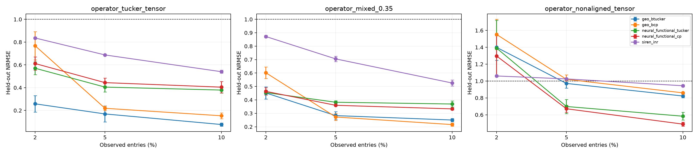
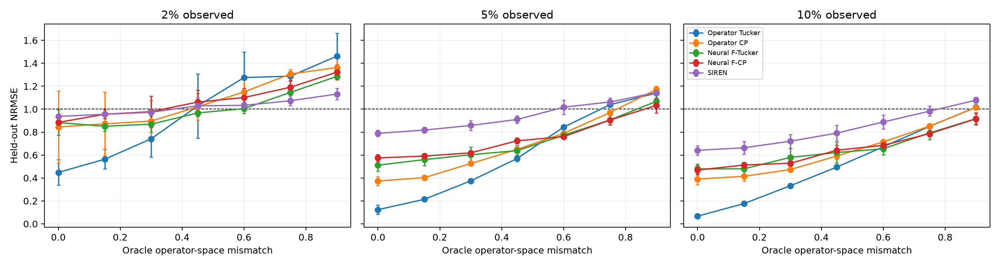
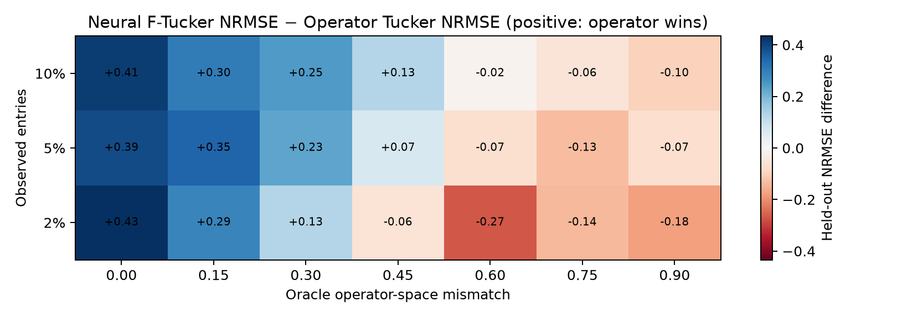
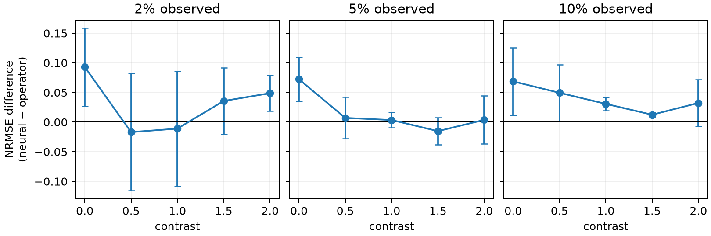
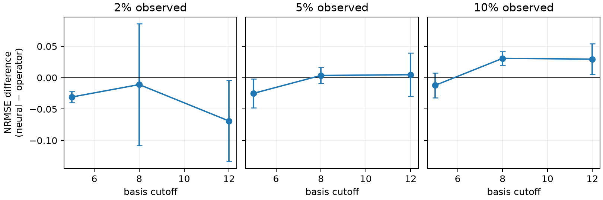
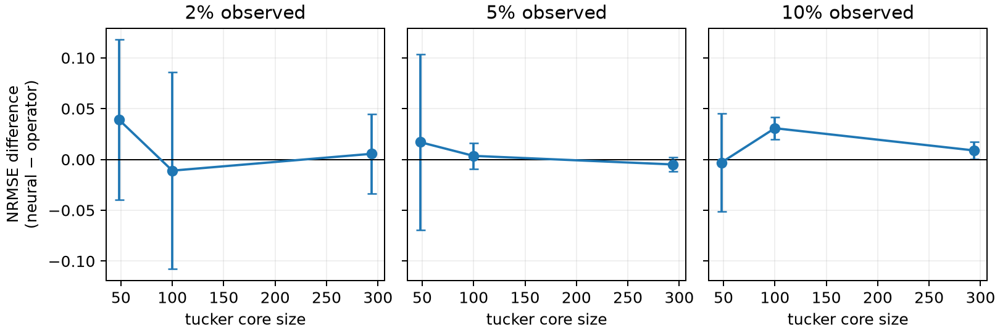

# 方向 1 技术报告：Operator-informed Bayesian Tucker

> **已被取代（2026-08-22）。** 本文写于项目还是"一维 Green tensor + 算子失配相图"
> 的阶段，当时的主张、数据集与判据都已经换过。当前入口是
> [`HANDOVER_ZH.md`](HANDOVER_ZH.md)（方法、推导、实验设定、坑），数据来源见
> [`DATASETS.md`](DATASETS.md)。
>
> 本文保留为审计痕迹。其中**仍然有效**的是第 2 节的 formulation 与第 3 节的
> inference 描述（它们是当前模型的前身，符号一致）；**已经失效**的是第 5 节的数据集
> 审计、第 8 节的证据、第 11–12 节的实验矩阵与 GO/NO-GO 门槛——那些数字是在
> `ranks=(4,5,5)`、一维张量、以及后来被证明秩受限的配置下得到的。

更新时间：2026-08-15  
状态：**已从人工 subspace rotation 推进到变系数扩散 Green tensor；10% 有较稳定正信号，2%--5% 仍是高方差/近似平局。**

## 0. 先给结论

这条线不应该删除。它有一个很清楚、也很实用的定位：

> 已知每个 tensor mode 上的几何或物理算子时，用算子的低频函数空间约束一个很小的 Tucker 模型；因子用正则化点估计，固定因子后对 core 做解析高斯推断。

它也确实可以理解为“每个因子都是 GP”的复杂模型的一个有限谱、低成本近似。若
$$K_m=\Phi_m( I+\Lambda_m)^{-p}\Phi_m^\top,$$
则令 $U_m=\Phi_mW_m$、对 $W_m$ 施加相应二次惩罚，就是把因子限制在由
$K_m$ 定义的有限维 RKHS/GP 空间里。不过，当前实现**没有对因子做完整后验推断**，因此准确名称应是：

**operator-regularized Tucker with a conditional empirical-Bayes core posterior**。

当前证据分成两部分：

1. 在与方法结构高度一致的受控 Tucker tensor 上，2% 观测、结构缺失和高噪声均有明显正信号；
2. 在不规则椭圆场和 The Well 声学场上，绝对性能或相对性能为负。

本轮进一步把所有模型锁为 3 个 validation seeds、500 次梯度更新和随机初始化。2%--10%
ratio phase curve 表明：aligned truth 上 Operator Tucker 一直最强；35% format/local mismatch
下，2% 时它与 Neural Functional Tucker 基本持平，到 5% 后 operator family 才稳定领先；强
non-aligned truth 上 operator family 在所有 ratios 都落后于 neural functional CP/Tucker。因而当前故事
必须写成“正确或近似正确的 operator factor space 在达到可识别阈值后降低样本复杂度”，不能笼统写成
“越稀疏优势越大”或“任意平滑场都受益”。

method-matched neural functional CP/Tucker 与 INR 已经加入。新的变系数扩散实验也不再通过人工旋转
制造 mismatch：真值和 learner 来自不同的物理扩散算子，并报告实际 projection residual。当前最重要的
不是加组件，而是在冻结 cutoff/rank 后做 fresh-seed 与结构缺失确认，并最终迁移到一个公开 solver 数据集。

## 1. 科学问题与论文故事

### 1.1 要回答的问题

普通 Tucker completion 写作
$$Y_{i_1i_2i_3} \approx\sum_{a=1}^{R_1}\sum_{b=1}^{R_2}\sum_{c=1}^{R_3} G_{abc}U_1(i_1,a)U_2(i_2,b)U_3(i_3,c).$$
传统 factor table 把 mode index 当作没有关系的类别。例如，它无法预先知道：

- 一个 mode 是周期圆周，首尾应连接；
- 一个 mode 是有 Dirichlet/Neumann 边界的区间；
- 一个 mode 是不规则 mesh，其邻接关系和孔洞会改变平滑函数空间。

方向 1 的问题是：**在不超过 10% 的稀疏观测下，已知且近似正确的算子函数空间，能否降低 tensor factors 的样本复杂度？**

### 1.2 最小贡献应该只有三个

1. **因子空间由 mode operator 定义。** 几何不是额外输入，而是直接限制每个 mode factor 可以是什么函数。
2. **保留显式小 Tucker core。** 与 CP 相比，它允许跨 mode 的非对角交互；与 flat product GP 相比，它不需要保留大量笛卡尔积特征。
3. **轻量条件后验。** 因子固定后，小 core 是标准 Bayesian linear regression，可解析得到均值和协方差。

不应把“全贝叶斯因子”“自动 Tucker rank”“通用不规则域模型”写进当前贡献。

## 2. Formulation

### 2.1 算子因子

对 mode $m\in\{1,2,3\}$，给定自伴算子
$$\mathcal A_m\phi_{mk}=\lambda_{mk}\phi_{mk}, \qquad \Phi_m(i,k)=\phi_{mk}(x_i).$$
保留 $K_m$ 个 eigenfunctions，并定义
$$\widetilde U_m=\Phi_mW_m, \qquad U_m(:,r)=\frac{\widetilde U_m(:,r)} {\sqrt{N_m^{-1}\lVert \widetilde U_m(:,r)\rVert_2^2}}.$$
单位 RMS 约束去掉 Tucker 的 mode/core 连续缩放歧义。预测为
$$\widehat Y_{ijk} =\sum_{abc}G_{abc}U_1(i,a)U_2(j,b)U_3(k,c).$$
### 2.2 归一化后的谱能量

本轮审计发现并修正了一个重要问题。旧实现对原始 $W_m$ 做惩罚，但前向使用归一化后的 $U_m$。把 $W_m$ 整体缩小几乎不改变预测，却会减小旧惩罚，这与声称的 MAP 目标不一致。

修正后令
$$s_{mr}=\sqrt{N_m^{-1}\lVert \Phi_mW_m(:,r)\rVert_2^2}, \qquad \bar W_m(:,r)=W_m(:,r)/s_{mr},$$
并使用
$$E_m(\bar W_m)= \frac{1}{K_mR_m}\sum_{kr}(1+\lambda_{mk})^p\bar W_{mkr}^2.$$
这样同时缩放一个 factor column 不再改变预测或先验能量；不同 basis 的整体数值标度也不会直接改变比较结果。实现位于
`src/geoaware/tensor_bayes.py::_normalized_spectral_coefficients`。

### 2.3 代码真正优化的目标

当前训练目标是
$$\mathcal L= \frac1{|\Omega|}\sum_{q\in\Omega} (y_q-\widehat y_q)^2 +\rho\left[ \frac{\lVert G\rVert_F^2}{R_1R_2R_3} +\sum_mE_m(\bar W_m) \right].$$
严格说，这是 **penalized MAP / regularized point estimation**。给定观测噪声方差以及维度相关的先验精度，它可重写为 Gaussian MAP；但当前代码没有在这一阶段联合学习一个完整概率生成模型。因此论文里不应仅用一句“MAP under the prior”掩盖 loss 的 mean-normalization 与 $\rho$ 的作用。

## 3. Inference 到底做了什么

### 3.1 初始化

默认随机初始化。较早结果使用 `--init flat_gp`：

1. 只用观测 entries 拟合 finite-feature operator GP；
2. 在全网格上取该 GP 的 posterior mean；
3. 对 posterior mean 做 HOSVD；
4. 把 HOSVD factors 投影回各 mode basis，并解一个 ridge core。

它没有读取 held-out truth，因而不是数据泄漏。但是它给 proposed model 一个很强的
observation-only warm start；functional neural baselines 当前从随机初始化开始。本轮公平主表因此统一采用
random cold start，另把 flat-GP 初始化单列为优化消融，不把它混入几何先验的主结论。

### 3.2 因子与 core 的联合点估计

AdamW 同时优化 $W_1,W_2,W_3,G$，保存训练目标最小的 checkpoint。没有独立 validation early stopping；超参数应在 selection seeds 上选完，再冻结到 confirmation seeds。

### 3.3 固定因子后的 core 后验

训练完成后固定 $U_1,U_2,U_3$，对每个观测构造
$$z_q=U_1(i_q)\otimes U_2(j_q)\otimes U_3(k_q), \qquad Z_\Omega=[z_q^\top]_q.$$
条件模型为
$$g=\operatorname{vec}(G)\sim\mathcal N(0,\alpha^{-1}I), \qquad y_\Omega\mid g\sim\mathcal N(Z_\Omega g,\beta^{-1}I).$$
因此
$$\Sigma_g=(\beta Z_\Omega^\top Z_\Omega+\alpha I)^{-1}, \qquad \mu_g=\beta\Sigma_gZ_\Omega^\top y_\Omega.$$
代码用 evidence updates 迭代估计标量 $\alpha,\beta$：
$$\gamma=P-\alpha\operatorname{tr}(\Sigma_g),\quad \alpha\leftarrow\gamma/\lVert \mu_g\rVert^2,\quad \beta\leftarrow(|\Omega|-\gamma)/\lVert y-Z\mu_g\rVert^2,$$
其中 $P=R_1R_2R_3$。这叫 **conditional empirical Bayes**：

- 对固定 factors、固定 $\alpha,\beta$，core Gaussian posterior 是解析且精确的；
- factors、ranks、basis、$p$ 和正则系数的不确定性没有积分；
- $\alpha,\beta$ 是 evidence 点估计，不是后验随机变量。

### 3.4 预测不确定性

对 query design $z_*$：
$$\mathbb E[y_*]=z_*^\top\mu_g, \qquad \operatorname{Var}(y_*)=z_*^\top\Sigma_gz_*+\beta^{-1}.$$
当前再用 analytic LOO residual 的 95% quantile 对标准差乘一个 scalar calibration factor。它只使用 observations，但不是独立 calibration set。`--split-calibration` 可做 observation-only split calibration。

目前 UQ 主张有三项限制：

1. factor uncertainty 被忽略，interval 往往会过窄；
2. proposed Tucker 默认带 LOO calibration，而现有 `flat_geo_gp` 路径输出的是 raw standard deviation，二者 NLL/coverage 并非完全公平；
3. CP 的 diagonal factor Laplace 忽略 RMS normalization 的导数，Tucker 更没有 factor Laplace。

因此在统一 calibration protocol 前，只应把 NRMSE/MAE 当主结果；coverage/NLL 是诊断，不是贡献证据。

## 4. 公式与实现逐项对应

| 概念 | 实现 | 审计判断 |
|---|---|---|
| $U_m=\Phi_mW_m$ | `OperatorBayesianTucker.factor_tables` | 正确，输出每列单位 RMS |
| Tucker row design | `OperatorBayesianTucker.tucker_design` | 正确，order-3，大小为 $R_1R_2R_3$ |
| operator energy | `factor_prior` | 本轮已改成对归一化 factors 的系数惩罚 |
| HOSVD warm start | `initialize_from_tensor` | 算法正确；公平性取决于 initializer 是否只用 observations |
| joint point fit | `fit` | 是正则化点估计，不是全后验 |
| core posterior | `_fit_core_posterior` | 固定 factors 后是标准 Bayesian linear regression |
| predictive mean/variance | `predict` | 只传播 core 与 noise uncertainty |
| rank inference | 固定 `ranks` | 没有自动 rank；`effective_rank` 只是返回给定 tuple |
| active acquisition | `run_tensor_core_iv_acquisition.py` | 已证伪：只看 core uncertainty 会选出不利于 factor refit 的点 |

## 5. 当前数据集审计

### 5.1 `operator_tucker_tensor`：适合机制 sanity，不足以做唯一主实验

- shape：`20×28×36`；mode 为 time interval、bounded range、periodic angle；
- 真值：使用与 learner 相同的 Neumann/Dirichlet/periodic basis，multilinear rank 为 `(4,5,5)`；
- 优点：能干净检查“正确 operator + non-diagonal core”是否工作；
- 致命局限：真值恰好在 learner 的有限 basis 和 rank 中，是明显的 model alignment / inverse crime。

所以它可以保留为 Figure 1 的 phase diagram 或 recovery sanity，但不能单独支撑“物理场上有效”。

### 5.2 CP/mixed synthetic

`operator_cp_tensor` 检查 CP 真值，`operator_mixed_tensor` 在 CP 与 dense Tucker 真值之间插值。它们能检查 core format mismatch，但两端仍使用相同 eigenfunction dictionary，不能检查 operator misspecification。

下一版 controlled truth 必须增加：

- 从更高分辨率 Matérn/operator GP 中抽样，再只给 learner 截断低频 basis；
- basis/operator 有连续扰动，而不是仅“完全正确”与“随机 permutation”；
- 局部尖峰、弱间断或非平稳长度尺度；
- 真 rank 与拟合 rank 不同。

### 5.3 The Well Active Matter

它有真实 `time×x×y` tensor 和严格 periodic x/y，几何语义与方向 1 匹配。官方数据包含 81 steps、256² grid 和 225 simulations，并明确是周期边界。现有本地 adapter 只取单条 trajectory 做 within-field completion，不能代表跨轨迹泛化。更重要的是，低频 global modes 未覆盖局部高频动力学，现有结果没有形成正信号。

它仍可作为公开 stress test，但任务应改成多 trajectory 的 `trajectory×time×space-node`，或明确只研究单场稀疏传感器重建。官方说明：[The Well Active Matter](https://polymathic-ai.org/the_well/datasets/active_matter/)。

### 5.4 The Well Acoustic Scattering

现有 1% smoke：operator Tucker NRMSE `1.309`，wrong operator `1.328`，flat Tucker `1.489`，operator CP `1.312`。后续 full graph-mode validation 约为 `1.000`。这说明模型没有完成有用重建，不能把 correct-vs-wrong 的小差距当正证据。

原因与当前模型假设也一致：声学场局部、高频，少量最低 graph modes 并不是合适 factor space。这条数据更适合方向 2，而不是继续为方向 1 调参。

### 5.5 不规则边界 wave/elliptic

1% irregular elliptic gate 的 macro NRMSE：correct Tucker `0.895`，correct operator CP `0.668`，coordinate CP `0.180`，SDF-coordinate CP `0.180`。这明确说明：低 graph modes 虽能编码拓扑，但对这组 source-conditioned field 的表达不如简单连续坐标因子。

还有一个评估语义问题：这些脚本主要是**在每个 geometry 内重新拟合**，不是对 unseen geometry 做共享模型泛化。方向 1 本来就是 fixed-tensor/few-shot completion，这并非错误；但论文不能把它称为 zero-shot geometry generalization。

### 5.6 下一批公开数据的优先级

1. **The Well `planetswe` 小子集。** 这是球面浅水场，天然适合把空间合并为一个 spherical node mode，再使用 spherical Laplacian/spherical harmonics；另两个 mode 可用 trajectory 和 time。它比把球面错误拆成独立 latitude/longitude operator 更合理。[The Well 数据总览](https://polymathic-ai.org/the_well/datasets_overview/)
2. **PDEBench 2D diffusion-reaction 或 shallow water。** 官方数据统一为 `[sample,time,x1,x2,variable]`，便于构造 `sample×time×space-node`。必须从官方 metadata 读取 BC，不能按数据名字猜 operator。[PDEBench 数据](https://darus.uni-stuttgart.de/dataset.xhtml?persistentId=doi%3A10.18419%2Fdarus-2986&version=7.0)
3. **WeatherBench2 64×32 ERA5。** 可测试 sphere-aware operator，但应合并空间节点并使用球面算子；它的数据量和气候基线复杂度更高，放第三优先级。[WeatherBench2 数据指南](https://weatherbench2.readthedocs.io/en/latest/data-guide.html)

## 6. Mask 与测试协议审计

### 6.1 现有 mask

- `random`：从所有 entries 均匀抽取，实际数量为 `round(ratio*N)`；
- `periodic_gap`：整个周期 seam 周围 25% sector 永不观测，再从其余位置抽取总 tensor 的指定比例；
- `block`：中心空间 block 永不观测，再从其他位置抽取指定比例；
- `sensor_tracks`：选定空间 sensors，并观测每个 sensor 的完整时间轨迹。

本轮增加了测试，确保 periodic gap 没有漏入 observation、指定 sector 全部进入 held-out，以及 sensor mask 真的是完整时间 fiber。

### 6.2 哪些 mask 回答什么问题

| mask | 能回答的问题 | 不能回答的问题 |
|---|---|---|
| random entry | 极稀疏插值、rank sample complexity | 真实传感器部署、外推 |
| periodic gap | 周期拓扑能否跨 seam 外推 | 一般不规则边界 |
| center block | 连通缺失区域的空间外推 | 未见 geometry |
| sensor tracks | 固定传感器的时空重建 | 任意 entry completion |
| missing fibers/slices（待加） | tensor sharing 是否补全整个 mode fiber | 局部随机插值 |

论文主表至少应包含 random、一个完整 fiber/slice missing、一个 geometry-specific gap。只用 random entry 会偏向低秩模型，也不能证明 operator geometry。

### 6.3 防泄漏规则

必须冻结：

1. normalize 只能使用 noisy observed values；现有实现满足；
2. GP initializer 只能使用 observations；现有实现满足；
3. rank、$p$、$\rho$、basis cutoff 和 neural steps 在 selection seeds 决定；
4. confirmation seeds 不得用于模型选择；
5. 外部数据按 trajectory/geometry 分组切分，不能把同一 trajectory 的相邻帧同时放入 train/test 后声称跨实例泛化。

## 7. Baseline 审计

### 7.1 已有且必要

| baseline | 隔离的因素 | 当前判断 |
|---|---|---|
| discrete Bayesian Tucker | 没有 side information | 必留，但当前 factors 也只是 MAP，命名需谨慎 |
| wrong/permuted operator Tucker | operator 与 index 对齐是否重要 | 必留；是强破坏性 control，不代表现实轻微 misspecification |
| topology-erased/bounding-box Tucker | 忽略孔洞/边界 | 不规则域实验必留 |
| operator CP | non-diagonal Tucker core 是否必要 | 必留 |
| flat product operator GP | multilinear compression是否必要 | 必留；需匹配 calibration protocol |

### 7.2 本轮补上的 method-matched baselines

新增 `src/geoaware/operator_tucker_baselines.py`：

- `NeuralFunctionalCP`：每个 scalar mode 一个小 MLP，通过 CP 相乘；
- `NeuralFunctionalTucker`：相同 mode MLP，通过显式 dense small core 收缩；
- 周期 mode 使用 `(sin(2πx),cos(2πx))`，因此不会因错误 raw-coordinate seam 吃亏；
- `SirenINR`：不做 tensor separation 的强 coordinate regression control。

`experiments/run_tensor_bayes.py` 已能运行 `neural_functional_cp`、`neural_functional_tucker`、`siren_inr`。它们是 deterministic reconstruction baselines，因此只输出 RMSE/NRMSE/MAE，不伪造 NLL 或 coverage。

### 7.3 仍然缺失

1. **经典 fully Bayesian CP/Tucker。** Zhao 等方法对所有 factors 与 hyperparameters 做 variational posterior，并自动裁剪 rank；当前方法不能用“Bayesian”一词绕过这一对比。[Bayesian CP](https://arxiv.org/abs/1401.6497)，[Bayesian Sparse Tucker](https://arxiv.org/abs/1505.02343)
2. **带 side-information 的 variational Bayesian CP。** 这是最接近方向 1 的传统对手：给定 fiber-span subspaces，并做自动 rank inference。区别应是我们的 subspace 来自物理 operator 且带 spectral energy，而不是假设 side-information 已精确包含真值 span。[Budzinskiy & Zamarashkin](https://arxiv.org/abs/2206.12486)
3. **deterministic operator Tucker。** 同样的 $\Phi,\Lambda$ 和 point optimization，但不做 conditional core posterior，用来隔离 Bayesian core 对重建与 UQ 的贡献。
4. **graph/Laplacian-regularized Tucker。** 使用完整 factor table 加 graph smoothness，而不是截断 eigenbasis；它可检查优势来自 spectral truncation 还是 operator smoothness 本身。
5. **parameter-matched neural sweep。** 当前 neural Tucker 比 proposed 大很多；需要“same ranks strong-capacity”主对照和“近似参数量”附录对照。

functional neural tensor 本身不是新结构，已有工作用分离 neural CP/Tucker 逼近连续 PDE 函数；它必须作为架构 baseline，而不是被写成弱 INR。[Functional Tensor Decompositions for PINNs](https://arxiv.org/abs/2408.13101)

### 7.4 公平性规则

- 同一个 noisy observation tensor、同一个 mask、同一个 normalization；
- rank-matched 比较回答 inductive bias，parameter-matched 比较回答效率，两者不要混成一个表；
- 早期 POC 统一使用 3 个 seeds 与 500 steps；不因为某方法收敛慢而临时增加预算；
- flat-GP/HOSVD warm start 必须作为单独初始化消融，并报告其额外 wall time，不能混入 cold-start 主表；
- 成熟论文阶段才在冻结的 validation budget 内给各方法独立调学习率/收敛步数，并同时报告固定预算结果；
- UQ 模型使用完全相同的 raw/LOO/split calibration protocol；
- 报告参数量、peak GPU memory、wall time，以及是否读取 operator/SDF/boundary metadata。

## 8. 当前证据

### 8.1 冻结的旧参数化结果

受控 Tucker truth、10 seeds：

| 设置 | Proposed Tucker | Operator CP | Flat operator GP | Wrong Tucker | Discrete Tucker |
|---|---:|---:|---:|---:|---:|
| 1% random | 0.676±0.072 | 0.809±0.072 | 0.752±0.030 | 1.462±0.097 | — |
| 2% random | **0.125±0.015** | 0.367±0.055 | 0.612±0.028 | 1.712±0.201 | 1.976±0.131 |
| 2% + center block | **0.174±0.074** | 0.515±0.103 | 0.631±0.030 | 1.640±0.119 | — |
| 2% + 30% noise | **0.487±0.091** | 0.969±0.134 | 0.661±0.025 | 1.631±0.111 | — |

这些结果证明机制在 aligned regime 中很强，但不能解决 external validity。

### 8.2 本轮 normalized-prior smoke

修正谱惩罚后，在相同 2% random、seed 30、500 steps：

| 模型 | NRMSE |
|---|---:|
| corrected operator Tucker | **0.155** |
| operator CP | 0.410 |
| flat operator GP | 0.597 |
| wrong operator Tucker | 1.489 |

旧参数化同一 seed 的 proposed 为 `0.153`。这一 smoke 表明修正没有消灭信号，但它不等价于重新确认旧十 seed 结果；完整结果需要重跑。

### 8.3 历史 functional baseline smoke（已被 R4 主表取代）

相同 2% mask、seed 30：

| 模型 | 500 steps | 2000 steps | trainable parameters |
|---|---:|---:|---:|
| operator Tucker（旧惩罚，仅比较该 smoke） | 0.153 | — | 247 |
| neural functional CP | 0.596 | 0.618 | 8,872 |
| neural functional Tucker | 0.523 | **0.307** | 8,178 |
| SIREN INR | 0.857 | 0.850 | 19,105 |

这里有两个信息：

- method-matched neural Tucker 仍未追上 operator Tucker，方向是正的；
- neural Tucker 从 500 到 2000 steps 大幅改善，说明 500-step 表衡量的是固定计算预算而非最终收敛上限。按当前早期 POC 协议，各方法仍统一锁为 500 steps；只有晋级后才做独立 convergence sweep。

该表只有一个已查看 seed，且 truth 与 operator 对齐，只能作为接口 smoke，不能进入论文结论。

### 8.4 R4：500-step 公平冷启动主表

本轮只使用 `operator_tucker_tensor` 的 validation entries；没有把此前已经读取的外部/孔洞
test 重新包装成新结论。统一协议为：3 seeds (`41,42,43`)、500 gradient steps、10% observed-value
noise、相同 observed normalization、相同 mask、全部 random initialization。Operator Tucker ranks
为 `(4,5,5)`，Operator CP rank 为 10；neural models 使用相同 ranks，并保留更大的网络容量。

| Mask / ratio | Operator Tucker | Operator CP | Neural F-Tucker | Neural F-CP | SIREN INR |
|---|---:|---:|---:|---:|---:|
| random / 1% | 1.2147±0.3165 | 1.2845±0.0299 | **0.8984±0.1035** | 0.9916±0.0941 | 0.9129±0.0113 |
| random / 2% | **0.2582±0.0718** | 0.7680±0.1243 | 0.5704±0.0625 | 0.6117±0.0583 | 0.8358±0.0080 |
| periodic gap / 1% | 0.9827±0.2131 | 1.2553±0.1235 | **0.9078±0.0911** | 0.9221±0.0693 | 0.9129±0.0227 |
| periodic gap / 2% | **0.5975±0.1298** | 0.6777±0.0580 | 0.7094±0.0474 | 0.6889±0.0507 | 0.8395±0.0217 |

可训练参数分别为 247、320、8,178、8,872、19,105。所有模型都是 500 steps；Operator
models 使用 AdamW `3e-3`，neural baselines 使用 `2e-3`。因此这是 rank-matched、固定训练预算比较，
不是 parameter-matched 比较；容量差异反而偏向 neural baselines。

最关键的判断有三点：

1. 2% random 的正信号很大：Operator Tucker 相对最强 neural tensor 约降低 55% NRMSE；
2. 1% 下所有结果接近或超过无效区间，Operator 方法尤其不稳定，不能宣称 extreme-sparse monotonic gain；
3. periodic gap 2% 的差距较小，说明周期 encoding 本身已让 neural CP/Tucker 成为强 baseline。

观测点拟合误差也被写入 artifact。SIREN 在四个设置的 observed NRMSE 都约为 `0.0001–0.0002`，
但 validation NRMSE 仍约 `0.83–0.91`，是清楚的极稀疏过拟合；Operator Tucker 的 observed
NRMSE 约 `0.13–0.14`。因此 2% 的优势不是因为它比 INR 更彻底地记住 observations，而是来自
受限 factor function space。1% 下该 function space/core 仍不足以被稳定识别。

初始化消融只替换 Operator Tucker 的 initialization，其余设置完全不变：flat-GP/HOSVD 将
random 1% 从 `1.2147±0.3165` 改善到 `0.8587±0.1118`，random 2% 从
`0.2582±0.0718` 改善到 `0.2290±0.1684`；periodic-gap 2% 从
`0.5975±0.1298` 改善到 `0.4220±0.0776`。这说明初始化确实重要，也说明旧结果不能完全归因于
operator prior。冷启动表仍是当前主表。

### 8.5 R4b：部分 generator 失配验证

为了检查 exact Tucker inverse crime，额外使用 `operator_mixed_0.35`：65% 是带局部非谱残差的
CP 场，35% 是 dense Tucker 场。它仍共享大部分 operator basis，因此只算“部分失配”，不是最终
external validation。协议仍为 3 seeds、2% random、500 steps、cold start。

| 模型 | Validation NRMSE |
|---|---:|
| Operator Tucker | **0.4517±0.0461** |
| Operator CP | 0.6020±0.0432 |
| Neural F-Tucker | 0.4562±0.0198 |
| Neural F-CP | 0.4633±0.0294 |
| SIREN INR | 0.9296±0.1058 |

Operator Tucker 只以约 1% 的平均 NRMSE 优于 Neural F-Tucker，且只赢 2/3 seeds；这不是有意义的
方法优势。正面部分是所有 separated tensor methods 都明显优于 SIREN，Tucker 也优于 Operator CP；
负面部分是 exact spectral Tucker 上的大幅领先一旦加入 format/local mismatch 就几乎消失。因此下一步
必须使用真正从更细 operator GP/PDE solver 生成、learner basis 被截断或扰动的数据，不能继续扩写 aligned
synthetic 的胜利。

### 8.6 R5：2%--10% observation-ratio phase curve



图中虚线为 NRMSE=1 的绝对有效性门槛；误差棒来自 3 个冻结 seeds。左、中、右依次为 aligned、35% mixed 与 strong non-aligned truth。

按用户给出的早筛预算，协议锁定为 random mask、3 seeds (`41,42,43`)、500 steps、10% observed-value
noise、cold start。每个 dataset/seed/ratio 上五个模型共享同一 mask、noise realization、observed-only
normalization 和训练预算；未观测 entries 只用于最后评估，不用于 checkpoint 或超参选择。以下都是 held-out
NRMSE（均值±样本标准差）。

**A. aligned operator-Tucker sanity**

| Ratio | Operator Tucker | Operator CP | Neural F-Tucker | Neural F-CP | SIREN |
|---:|---:|---:|---:|---:|---:|
| 2% | **0.2582±0.0718** | 0.7680±0.1243 | 0.5706±0.0571 | 0.6118±0.0587 | 0.8362±0.0077 |
| 5% | **0.1694±0.0704** | 0.2190±0.0197 | 0.4051±0.0432 | 0.4443±0.0405 | 0.6874±0.0055 |
| 10% | **0.0765±0.0142** | 0.1532±0.0259 | 0.3790±0.0270 | 0.4046±0.0495 | 0.5402±0.0134 |

这是预期的 aligned sanity：正确 operator space 中的 Tucker 在三个 ratios 都明显最好。它说明实现和
sample-efficiency mechanism 能工作，但仍有 inverse-crime，因此不单独作为论文主证据。

**B. 35% format/local mismatch（当前最接近正面主证据）**

| Ratio | Operator Tucker | Operator CP | Neural F-Tucker | Neural F-CP | SIREN |
|---:|---:|---:|---:|---:|---:|
| 2% | **0.4517±0.0461** | 0.6020±0.0432 | 0.4546±0.0183 | 0.4635±0.0267 | 0.8720±0.0085 |
| 5% | 0.2829±0.0292 | **0.2723±0.0254** | 0.3824±0.0112 | 0.3596±0.0026 | 0.7052±0.0204 |
| 10% | 0.2500±0.0120 | **0.2160±0.0115** | 0.3693±0.0222 | 0.3330±0.0074 | 0.5256±0.0227 |

2% 时 Operator Tucker 与 Neural F-Tucker 仅差 `0.0029`，不能称优势；5% 和 10% 时 operator
family 清楚优于 neural tensor baselines，但最佳 decoder 变成 CP。这给出两个比“固定 Tucker 最强”更可靠的
结论：

1. 对这份部分失配数据，实用可识别阈值约在 **5%**；
2. 正信号来自 operator-conditioned factor space 多于 dense Tucker core，因此论文方法应允许 Tucker/CP
   作为 decoder 选择，而不是把贡献绑死在 Tucker。

**C. 强 non-aligned approximation-error sanity**

为避免继续只做 inverse crime，新增一个明确不由 learner basis 生成的连续场：time/range factors 包含
coordinate warp、localized envelope 和 non-integer phases；periodic factor 包含超过 learner 七阶截断的
8/9/11 harmonics，并加入非分离 coupled residual。它是故意构造的 failure control，不是假装公开 PDE 数据。

| Ratio | Operator Tucker | Operator CP | Neural F-Tucker | Neural F-CP | SIREN |
|---:|---:|---:|---:|---:|---:|
| 2% | 1.3992±0.1533 | 1.5525±0.1792 | 1.3900±0.3302 | 1.2967±0.2407 | **1.0600±0.0107** |
| 5% | 0.9715±0.0549 | 1.0202±0.0529 | 0.6981±0.0831 | **0.6711±0.0406** | 1.0251±0.0111 |
| 10% | 0.8224±0.0216 | 0.8598±0.0080 | 0.5827±0.0454 | **0.4889±0.0239** | 0.9441±0.0133 |

这里没有 operator 胜利：2% 时所有模型都近乎无效；5%--10% 时 Neural F-CP 最强。Operator Tucker
在 10% 的 observed NRMSE 仍为 `0.6525±0.0064`、held-out 为 `0.8224±0.0216`，显示主要问题是
截断 operator space 的 approximation bias，而非简单训练过拟合。相反，mixed truth 上 SIREN 在 2/5/10%
的 observed NRMSE 约为 `0.0005/0.0002/0.0001`，held-out 却为 `0.872/0.705/0.526`，是典型 sparse
memorization。二者共同形成清楚的 phase diagram：operator bias 只有在 basis mismatch 足够小且 observations
足以识别 factors 时才有益。

本轮不再把“observation ratio 越低，operator 越强”作为假设。更准确的可检验主张是：给定可诊断的
operator approximation error，存在一个 bias--variance 区域，使有限 operator factor space 比高容量 neural
factor 更稳定。下一步应沿 mismatch strength × observation ratio 二维图做连续控制，而不是只选有利的一个点。

### 8.7 R6：可校准的 operator mismatch × observation ratio 二维相图



上一轮的 aligned / mixed / non-aligned 三点仍混入了 generator format、频率和局部残差等多个变化，不能把
横轴解释为单一的 operator approximation error。本轮新增一个只改变 factor subspace alignment 的
rank-$(4,5,5)$ Tucker generator：core、rank 和总信号能量固定，每个 mode 的 factor 写成

$$A_m(\delta)=qA_m^{\parallel}+\sqrt{1-q^2}A_m^{\perp},\qquad q=(1-\delta^2)^{1/6},$$

其中 $A_m^{\parallel}$ 位于 learner operator span，$A_m^{\perp}$ 与它正交。对三模乘积投影
$\Pi=P_1\otimes P_2\otimes P_3$，构造保证

$$\frac{\lVert Y-\Pi Y\rVert_F}{\lVert Y\rVert_F}=\delta.$$

因此 $\delta$ 是可审计的 oracle relative approximation error，而不是任意数据混合权重。它只用于机制
诊断，不假设真实 PDE 的失配一定是一维的。实验锁定 $\delta\in\{0,.15,.30,.45,.60,.75,.90\}$、
2%/5%/10% random observations、3 seeds (`41,42,43`)、500 steps、10% noise 和 cold start；五个模型仍共享
mask、noise realization 与 observed-only normalization。

下表给出 `Neural F-Tucker NRMSE − Operator Tucker NRMSE`；正值表示 Operator Tucker 更好。

| Observed | $\delta=0$ | .15 | .30 | .45 | .60 | .75 | .90 |
|---:|---:|---:|---:|---:|---:|---:|---:|
| 2% | +0.43 | +0.29 | +0.13 | -0.06 | -0.27 | -0.14 | -0.18 |
| 5% | +0.39 | +0.35 | +0.23 | +0.07 | -0.07 | -0.13 | -0.07 |
| 10% | +0.41 | +0.30 | +0.25 | +0.13 | -0.02 | -0.06 | -0.10 |



这次得到的是比“极稀疏一定更有利”更具体、也更诚实的真信号：

1. **低到中等失配区稳定为正。** $\delta\leq.30$ 时三种 ratios 下 Operator Tucker 的平均优势均为
   `0.13--0.43` NRMSE；除 2%/$\delta=.30$ 为 2/3 seeds 外，其余格点均为 3/3 seeds 获胜。
2. **phase boundary 可见。** 2% 的均值排序在 $.30$--$.45$ 之间反转；5% 和 10% 在 $.45$--$.60$
   之间反转。10%/$\delta=.60$ 仅差 `-0.017`，属于近似平局，不应选边宣称。
3. **更多 observations 略微扩大可容忍失配，而不是削弱 operator prior。** 2%/$\delta=.45$ 时两者都接近
   无效（`1.027 vs 0.967`）；5% 和 10% 同一点仍有绝对有效预测，Operator Tucker 分别为
   `0.570 vs 0.638`、`0.495 vs 0.622`。
4. **高失配区的失败来自可见 bias。** $\delta=.90$、10% 时 Operator Tucker observed NRMSE 已达
   `0.822`，held-out 为 `1.017`，而 Neural F-Tucker 为 `0.918`；增加 observations 无法消除截断
   subspace 的 approximation error。

因此当前最稳妥的 Paper-A claim 是：**operator factor space 在可诊断的低/中等 approximation-error
区域提供 sample-efficiency；它存在可测量的 bias--variance phase boundary，而不是普遍优于 functional
tensor。** 这仍是 controlled synthetic mechanism evidence；下一步优先把横轴换成 PDE/operator 参数扰动
和真实 solver projection residual，而不是继续加密同一个 synthetic 网格。

### 8.8 R7：真实 PDE 参数扰动下的三轮 POC

#### 数据与失配不再是人工旋转

新增 `diffusion_green_tensor`，求解变系数 Neumann 扩散方程的离散 Green 响应：

$$\partial_t u+\left[-\partial_x(a(x)\partial_x)+\kappa I\right]u=0, \qquad \partial_nu|_{\partial\Omega}=0.$$

构造的三阶张量为 $Y(t,x_{\rm recv},x_{\rm src})$。truth 使用变系数

$$a(x)=\exp\{c[\cos(2\pi x)+0.35\sin(3\pi x+0.37)]\}$$

对应的 eigenfunctions 与 decay rates；learner 始终使用 $c=0$ 的常系数参考算子及其有限谱。
因此 $c$ 改变的是物理 eigenfunctions 和时间衰减，而不是人为混合两个正交矩阵。对每个生成 tensor 都实际计算

$$\delta_{\rm proj}=\frac{\lVert Y-(P_t\otimes P_r\otimes P_s)Y\rVert_F}{\lVert Y\rVert_F}.$$

有限体积离散、operator eigenpairs、diffusivity min/max、cutoff、truth modes、reaction 和
$\delta_{\rm proj}$ 全部进入 JSON dataset metadata。实现位于 `src/geoaware/tensor_data.py`，测试覆盖
正定/有限输出、attached basis 审计以及强物理扰动增大 residual。

统一早筛协议为 2%/5%/10% random entries、seeds `41,42,43`、400 steps、10% observed-value noise、
observed-only normalization 和 cold start。五个公平基线是 Operator Tucker、Operator CP、
Neural Functional Tucker、Neural Functional CP 与 SIREN；Tucker 比较使用相同 multilinear ranks。

#### R7.1 物理 diffusivity contrast

固定 cutoff=8，$c=0/.5/1/1.5/2$ 对应实测 residual
`.0459/.0514/.0699/.0845/.0965`。下表列出 Operator Tucker / Neural F-Tucker 均值：

| contrast | 2% | 5% | 10% |
|---:|---:|---:|---:|
| 0.0 | **.404** / .497 | **.278** / .350 | **.240** / .309 |
| 0.5 | .334 / **.318** | **.213** / .220 | **.171** / .220 |
| 1.0 | .273 / **.262** | **.206** / .210 | **.158** / .189 |
| 1.5 | **.254** / .290 | .203 / **.188** | **.162** / .175 |
| 2.0 | **.248** / .297 | **.204** / .208 | **.159** / .192 |



10% 的 paired signal 最稳定：五个 contrast 中四个为 3/3 seeds、一个为 2/3 seeds 获胜。2%/5% 的均值
多为小差异或高方差，不能声称稳定领先。注意 contrast 增大后 absolute task difficulty 也改变，因而不能把
contrast 或 residual 单独当成 difficulty；它们只衡量 learner 的 operator approximation bias。

#### R7.2 basis cutoff 证伪“越大越好”

固定 $c=1$，cutoff 5/8/12 将 residual 从 `.1645` 降到 `.0699/.0253`，但 Operator Tucker NRMSE 为：

| cutoff | residual | 2% | 5% | 10% |
|---:|---:|---:|---:|---:|
| 5 | .1645 | .293 | .235 | .201 |
| 8 | .0699 | **.273** | .206 | **.158** |
| 12 | .0253 | .331 | **.205** | .159 |



cutoff 12 的 oracle bias 最低，却在 2% 最差；cutoff 5 则在 5%/10% 仍受欠表达限制。因而 spectral cutoff
本身就是 bias–variance 参数，不能根据全真值 oracle residual 选择。当前 cutoff 8 只是 validation compromise，
必须冻结后再用 fresh seeds 确认。

#### R7.3 matched Tucker rank

固定 $c=1$、cutoff=8，同时给 Operator/Neural Tucker 使用 `(3,4,4)`、`(4,5,5)`、`(6,7,7)`：

| ranks（core size） | 2% Operator / Neural | 5% Operator / Neural | 10% Operator / Neural |
|---|---:|---:|---:|
| 3×4×4（48） | **.260** / .299 | **.223** / .240 | .186 / **.183** |
| 4×5×5（100） | .273 / **.262** | **.206** / .210 | **.158** / .189 |
| 6×7×7（294） | **.303** / .309 | .223 / **.218** | **.145** / .154 |



10% 下默认与大 core 保留小但一致的 mean advantage；小 core 打平。2%/5% 的 paired differences 大多
接近零或方差较大。这排除了“只有精确 rank 才能工作”的最坏情况，但没有支持 rank-insensitive superiority。

**R7 总判断：conditional GO。** 物理 operator prior 确实能在 10% 观测下产生可重复正信号，且 cutoff
呈现有解释的 bias–variance tradeoff；但极稀疏 2%--5% 尚未稳定超过 neural functional tensor。下一门槛是：
冻结 cutoff/rank，在 fresh 5 seeds 与 source/receiver structured fibers 中至少 4/5 获胜，同时保持 NRMSE
显著低于 1。在通过该门槛前，不扩大“通用 PDE”叙事。

### 8.9 active acquisition 是明确负结果

1% 初始观测再增加 1%：correct core-IV `0.206±0.014`，random `0.137±0.010`。原因是 acquisition 只优化固定 factors 下的 core variance，而新点加入后 factors 会重拟合。除非将 factor uncertainty 纳入 acquisition，否则不再继续包装这条支线。

## 9. 与相关工作的准确边界

- 经典 Bayesian CP/Tucker 对全部 latent factors 做 posterior inference，并可自动定 rank；当前方法计算更轻，但 Bayesian 程度更弱。[Bayesian CP](https://arxiv.org/abs/1401.6497)，[Bayesian Sparse Tucker](https://arxiv.org/abs/1505.02343)
- side-information CP 已表明低维 fiber-span side information 可降低 sample complexity；方向 1 的新增点必须是“operator-defined function space + spectral shrinkage + Tucker core”，而不能只说“factor 有 side information”。[Variational Bayesian CP with side information](https://arxiv.org/abs/2206.12486)
- smooth tensor decomposition 已经研究 factor smoothness；我们的 operator/topology 语义和 extreme sparse physical-field protocol需要构成差异。[Tensor Decomposition with Smoothness](https://proceedings.mlr.press/v70/imaizumi17a.html)
- finite eigenfunction GP 是成熟的 reduced-rank GP 思路；我们应主动把方向 1 定位为 factor-GP 的便宜近似，而不是假装与 GP 无关。
- neural functional CP/Tucker 已是明确文献方向，必须作为 baseline。[Functional Tensor Decompositions for PINNs](https://arxiv.org/abs/2408.13101)
- 非线性/GP tensor decomposition 也有大量先例，例如 [Gaussian-process nonparametric tensor estimator](https://proceedings.mlr.press/v48/kanagawa16.html)、[Streaming Nonlinear Bayesian Tensor Decomposition](https://proceedings.mlr.press/v124/pan20a.html) 与 [NONFAT](https://proceedings.mlr.press/v162/wang22ar.html)。这些方法的任务不完全相同，但限定了“GP + tensor”不能单独作为创新。

## 10. 风险清单

### 高风险

1. **inverse crime：** strongest evidence 由 learner 的同一 basis/rank 生成。
2. **外部无效：** The Well acoustic 与 irregular elliptic 均未支持通用物理场 claim。
3. **factor uncertainty 缺失：** conditional core interval 不能代表完整 posterior。
4. **baseline 优化不公平：** proposed 有 GP/HOSVD warm start；neural baseline 需要更多 steps。
5. **名称风险：** 若标题直接写 Bayesian Tucker，reviewer 会合理要求与 fully Bayesian Tucker 比 posterior、rank selection 和 calibration。

### 中风险

1. rank、basis cutoff、$p$、$\rho$ 固定，暂无自动选择；
2. calibrated factor-subspace mismatch 已完成，但仍需 PDE/operator 参数扰动来验证相图不是 generator 特例；
3. current order-3 implementation 不支持任意 ragged modes；
4. graph eigenbasis 的构建和 storage 在大 mesh 上会成为成本瓶颈；
5. 当前 irregular-grid eigenproblem 使用普通 Euclidean inner product；对真正非均匀 mesh，应解带 mass matrix 的 generalized eigenproblem $L\phi=\lambda M\phi$，否则节点密度会改变所谓“低频”；
6. scalar $\alpha$ 对整个 core 各向同性，不能做 multilinear rank shrinkage。

## 11. 下一轮实验矩阵

### E1：修正后受控 phase diagram（先做）

| 轴 | 设置 |
|---|---|
| truth | exact spectral Tucker；部分 format/local mismatch；截断 Matérn draw；强 non-aligned smooth field；弱局部尖峰 |
| fitted rank | under / matched / over-specified |
| observation | 2%、5%、10%（本阶段不超过 10%） |
| noise | 0%、10%、30% field std |
| mask | random、periodic gap、center block、missing fibers、sensor tracks |
| geometry | correct、轻微 operator perturbation、topology erased、random permutation |
| seeds | 3 validation；最终 confirmation 也控制在 3–5 个 fresh seeds |

早期 selection 全部固定 500 steps。只有方向通过数据与 baseline 门槛后，才投入更长的
convergence sweep；不能在某一 seed 或某一方法上临时延长训练。

主比较：correct operator Tucker、operator CP、flat GP、discrete Tucker、graph-regularized Tucker、neural functional CP/Tucker、SIREN。

### E2：The Well Active Matter，多 trajectory

- tensor：`trajectory × time × flattened periodic spatial node`；
- spatial operator：2D periodic Laplacian；
- 两个 protocol：within-trajectory sparse sensing、held-out-trajectory few-shot adaptation；
- masks：random entries 与 persistent sensors；
- baseline：neural functional Tucker/CP、SIREN、flat operator GP，以及同任务下适当的 FNO/TFNO；
- 不再用单条 trajectory 结果代表 dataset-level evidence。

### E3：球面 shallow water

- 首选 The Well `planetswe` 的 streaming/downsampled subset；
- tensor：`trajectory × time × sphere-node`，空间 mode 用 spherical Laplacian/harmonics；
- wrong geometry：equirectangular planar Laplacian，而不是随机 permutation；
- 重点看 structured sensors、跨纬度区域缺失和极区误差。

### E4：UQ 审计

- raw posterior、LOO calibrated、独立 split calibrated 三种协议分别报告；
- proposed、flat GP、经典 Bayesian Tucker 使用相同 calibration data；
- 指标：NLL、coverage、interval width、error-uncertainty rank correlation；
- 若不实现 factor posterior，不再做 active acquisition。

## 12. GO / NO-GO 门槛

### 继续作为完整论文（GO）

必须同时满足：

1. 在**非 model-aligned controlled truth 的一段预注册 mismatch 区域**上，correct operator tensor family 相对最强 functional/neural tensor 或 flat GP 至少降低 15% NRMSE，3–5 个 fresh seeds 中至少 80% 获胜；
2. 在至少一个公开物理数据集上 macro NRMSE ≤ 0.8，并且相对最佳 trivial predictor 至少有 20% MSE skill；
3. correct operator 相对轻微错 operator/topology-erased control 至少降低 10% MSE，证明几何而非单纯容量；
4. Tucker/CP decoder 必须在 validation 前冻结选择规则；若 Tucker 不稳定超过 CP，就把 dense core 降为可选 decoder，不再宣称它是必要贡献；
5. 所有 neural baselines 单独调到 validation convergence，并补 classical Bayesian/side-information tensor baseline；
6. 若保留 UQ contribution，统一 calibration 后 coverage 在 0.90–0.98，且 interval 比同 coverage 的 flat GP 更窄，或实现 factor uncertainty。

### 降级为学生项目/机制短文（LIMITED GO）

- controlled misspecification phase diagram 稳定为正；
- 但只有一个较简单 public dataset 或 UQ 不够完整；
- 标题和摘要明确写“finite operator-feature / conditional Bayesian core”，不宣称 fully Bayesian 或通用 geometry learning。

### 停止扩展（NO-GO）

出现任一项：

1. 正信号只在 exact eigenbasis-generated truth 上存在；
2. 收敛充分的 neural functional Tucker/CP 在 misspecified truth 上稳定持平或更好；
3. 两个合理公开数据 task 均 NRMSE 约 1，或 geometry control 差异小于 5% MSE；
4. 需要不断增加 architecture 特例才能保持优势。

此时保留代码作为方向 3 的 finite-feature baseline，不继续包装成独立完整论文。

## 13. 本轮新增与复现

新增/修改：

- `src/geoaware/operator_tucker_baselines.py`：method-matched neural functional CP/Tucker；
- `experiments/run_tensor_bayes.py`：支持 neural functional baselines，并禁止 deterministic baseline 输出伪 UQ；
- `src/geoaware/tensor_bayes.py`：修正归一化 factor 与谱惩罚不一致；
- `tests/test_benchmark.py`（该文件写于 `test_paper_methods.py` 时期，那批断言已并入当前测试）：增加 factor-prior scale invariance、periodic seam、structured mask 语义测试；
- `papers/four_tracks/results/track1_fixed_budget_validation_r2/`：3-seed、500-step cold-start 公平主表；
- `papers/four_tracks/results/track1_initializer_ablation_validation_r2/`：仅 Operator Tucker 的 flat-GP 初始化消融；
- `papers/four_tracks/results/track1_mixed_validation_r2/`：部分 generator 失配、2% random 验证；
- `src/geoaware/tensor_data.py::operator_nonaligned_tensor`：带 coordinate warp、高频截断失配和 coupled residual 的 failure-control generator；
- `experiments/analyze_track1_ratio_phase.py`：强制 ratio 不超过 10%，汇总 observed/held-out error 与 phase curve；
- `papers/four_tracks/results/track1_ratio_phase_{aligned,mixed,nonaligned}_r5/`：2/5/10%、3-seed raw artifacts；
- `papers/four_tracks/results/track1_ratio_phase_summary_r5/`：统一 summary JSON 与 phase-curve 图；
- `src/geoaware/tensor_data.py::operator_basis_mismatch_tensor`：投影残差精确等于给定 $\delta$ 的连续失配 generator；
- `experiments/analyze_track1_mismatch_phase.py`：汇总二维相图、seed wins 与 observed/held-out error；
- `papers/four_tracks/results/track1_mismatch_phase_{0.00,...,0.90}_r6/`：7-level、2/5/10%、3-seed raw artifacts；
- `papers/four_tracks/results/track1_mismatch_phase_summary_r6/`：统一 summary JSON、误差曲线和优势热图；
- `papers/four_tracks/results/track1_*_smoke/`：本轮 smoke artifacts。

复现本轮 cold-start 主表：

```bash
export PYTHONPATH=src
PY=/home/ubuntu/project/yanjiu/.venv/bin/python

$PY experiments/run_tensor_bayes.py \
  --output papers/four_tracks/results/track1_fixed_budget_validation_r2 \
  --task tucker \
  --models geo_btucker,geo_bcp,neural_functional_tucker,neural_functional_cp,siren_inr \
  --ratios .01,.02 --masks random,periodic_gap --seeds 41,42,43 \
  --tucker-ranks 4,5,5 --rank 10 --steps 500 \
  --reg .002 --noise .1 --init random --device cuda
```

复现 R5 phase curve：

```bash
export PYTHONPATH=.python-packages:src

for TASK in tucker nonaligned; do
  python3 experiments/run_tensor_bayes.py \
    --output papers/four_tracks/results/track1_ratio_phase_${TASK}_r5 \
    --task $TASK \
    --models geo_btucker,geo_bcp,neural_functional_tucker,neural_functional_cp,siren_inr \
    --ratios .02,.05,.10 --masks random --seeds 41,42,43 \
    --steps 500 --noise .1 --init random --device cuda
done

python3 experiments/run_tensor_bayes.py \
  --output papers/four_tracks/results/track1_ratio_phase_mixed_r5 \
  --task mixed --mismatch .35 \
  --models geo_btucker,geo_bcp,neural_functional_tucker,neural_functional_cp,siren_inr \
  --ratios .02,.05,.10 --masks random --seeds 41,42,43 \
  --steps 500 --noise .1 --init random --device cuda
```

复现 R6 calibrated mismatch phase diagram：

```bash
export PYTHONPATH=.python-packages:src

for MISMATCH in 0.00 0.15 0.30 0.45 0.60 0.75 0.90; do
  python3 experiments/run_tensor_bayes.py \
    --output papers/four_tracks/results/track1_mismatch_phase_${MISMATCH}_r6 \
    --task basis_mismatch --mismatch $MISMATCH \
    --models geo_btucker,geo_bcp,neural_functional_tucker,neural_functional_cp,siren_inr \
    --ratios .02,.05,.10 --masks random --seeds 41,42,43 \
    --rank 5 --tucker-ranks 4,5,5 --steps 500 --noise .1 --init random --device cuda
done

python3 experiments/analyze_track1_mismatch_phase.py \
  --inputs papers/four_tracks/results/track1_mismatch_phase_{0.00,0.15,0.30,0.45,0.60,0.75,0.90}_r6 \
  --output papers/four_tracks/results/track1_mismatch_phase_summary_r6
```

当前方向 1 定向测试：`tests/test_benchmark.py`（该文件写于 `test_paper_methods.py` 时期，那批断言已并入当前测试） 共 21 项通过。
